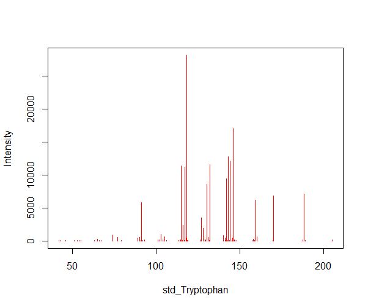
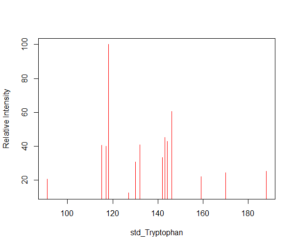
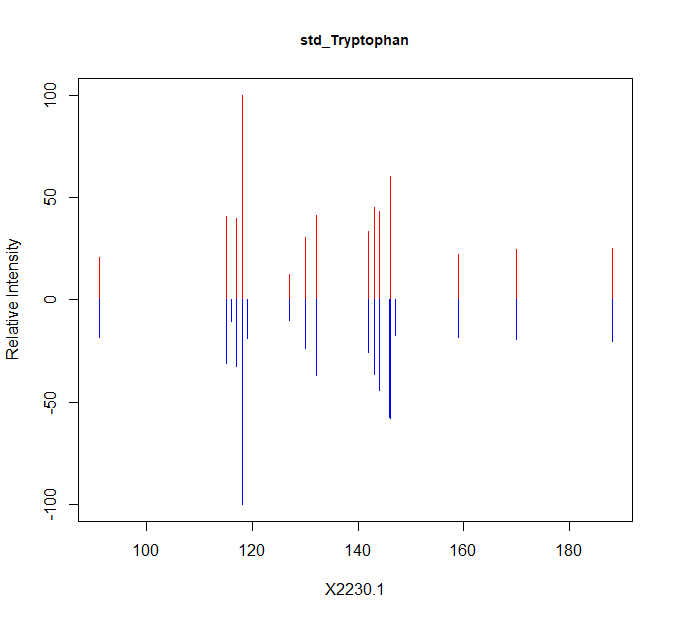

```{r, include = FALSE}
knitr::opts_chunk$set(
  collapse = TRUE,
  comment = "#>"
)
```

```{r , eval=FALSE}
library(margheRita)
```


# generate dataset for metabolite annotation 
mass spectroscopy provides us variety of information but, metabolite annotation needs only four set of data called feature data and reference including Retention time and m/z and spectra of the feature and reference. 
`annotation_dataset()` function generate required data. 


# metabolite annotation function 
metabolite annotation function uses the four dataset and default values for retention time threshold, range of acceptable and unacceptable PPM error, acceptable relative intensity in order to have a clean dataset and number of the most intensive peaks which are calculated for acceptable PPM error. all these values are modifiable based on the specificity and goal of the study. 

```{r, eval=FALSE}
metabolites_annotation = metabolite_annotation(feature_data = NULL , reference = NULL , feature_spectra = NULL, reference_spectra= NULL,
                                               rt_err_thr=1, 
                                               unaccept_flag=15, accept_flag=5, suffer_flag=10,
                                               acceptable_RI = 10,
                                               n_peaks=1, acceptable_PPM_err = 10)
```

* `feature_data`: ... parameter, default value is NULL. it is a data frame contains retention time (rt) and m/z (mz) of the sample which are stored by their specific ID (Feature_ID)

* `reference`: ... parameter, default value is NULL. it is a data frame contains retention time (rt) and m/z (mz) of the compounds which are stored by the name of the compound (Name)

* `feature_spectra`: ... parameter, default value is NULL. it is extracted from MS/MS spectroscopy. it is a list of sample ID which each contains list of its m/z and Intensity for each ion

* `reference_spectra`: ... parameter, default value is NULL. it is extracted from MS/MS spectroscopy. it is a list of compounds names which each contains list of its m/z and Intensity for each ion.

* `rt_err_thr`: ...parameter, default value is 1. it is tolerance window of retention time that align sample with compound. 

* `unaccept_flag`: ...parameter, default value is 15. it is specify the unacceptable number for PPM error. the number above this will be deleted.

* `accept_flag`: ...parameter, default value is 5. it is specify a range of the acceptable number for PPM error. PPM error below 5 will tagged by "super" flag and PPM error above 5 and below 10, tagged by "acceptable" flag.

* `suffer_flag`: ...parameter, default value is 10. it is specify a lowest acceptable number for PPM error in suffer group. range of PPM error between 10 and 15 will tagged as "suffer".

* `acceptable_RI`: ...parameter, default value is 10. it is cleaning the data set both in library and sample by deleting the low intensity peaks.

* `n_peaks`: ...parameter, default value is 1. it is specify the number of the most intense peaks of ion in MS/MS data that PPM error are calculated on.

* `acceptable_PPM_err`: ...parameter, default value is 10. it is specify the lowest acceptable PPM error for the ions in MS/MS data.


# The workflow of metabolic identification 
beneath of the metabolite annotation function there are four main steps. 

a) Retention time similarity. If RT of precursor in Library is close to RT in Sample
b) mass similarity by calculating PPM error
c) converting intensity to relative intensity
d) ion mass similarity by calculating PPM error for intensive peaks for MS/MS spectroscopy 

## a)retention time similarity
If the retention time for the metabolite i in reference library be t_i and the retention time for the compound j in the sample be t_j then the retention time error between a sample feature j and metabolite i in the reference library is the absolute difference between the two retention times

```{r, eval=FALSE}
RT = check_RT(feature_data = NULL , reference = NULL, rt_err_thr= rt_err_thr)
```

## b)mass similarity by calculating PPM error
The similarity between two masses is calculated by the ppm error (parts per million) which is determining mass tolerance. The PPM error is calculated as the relative error between the mass of a feature j and mass of the reference in the library i.

according to our study goal, we delete those with bad PPM error and assign a feature to the one with good PPM error in mass status column. 

Ppm error < a – super

Ppm error < b – acceptable, may happen when ions are of low intensities

Ppm error < c – may happen when machine suffer a bit.

Ppm error > c – not good


```{r, eval=FALSE}
mass = check_mass(feature_data = NULL , reference = NULL, unaccept_flag= c, accept_flag= a, suffer_flag= b)
```


### Merging ideal candidate in term of Retention Time and PPM error

```{r, eval=FALSE}
RT_mass = check_RT_mass (RT , mass, reference= NULL )
```

## c) establishing new library & sample data by calculating relative intensity
convert intensity to relative intensity and deleting the negligible relative intensity, both in library and sample spectra.
relative intensity is calculated by dividing ion intensity to the maximum ion intensity in spectra.

```{r, eval=FALSE}
RI_lib = RI_lib_data ( reference = NULL , RT_mass, acceptable_RI = acceptable_RI)
```


```{r, eval=FALSE}
RI_sample = RI_sample_data (feature_spectra= NULL, acceptable_RI = acceptable_RI )
```


     



## d) ions mass similarity by calculating PPM error for intensive peaks for MS/MS spectroscopy 

Those peaks candidate that distinguishing as metabolite i among compound j in the sample have two main criteria at the same time: strong relative intensity and good PPM error. 
the most important peaks are the most intense ones. So, we are calculating the PPM error pick by pick for the most intense ones by contribution of `calc_ppm_err()` function.
the number of the peaks that we are considering depends on the accuracy and goals study.

```{r, eval=FALSE}
intense_peak = check_intense_peak(RT_mass, RI_lib , RI_sample, n_peaks = n_peaks , acceptable_PPM_err = acceptable_PPM_err)
```

 
 

