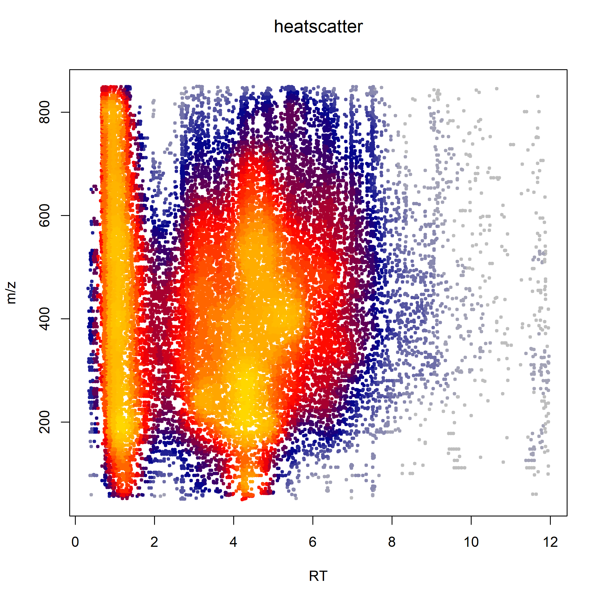
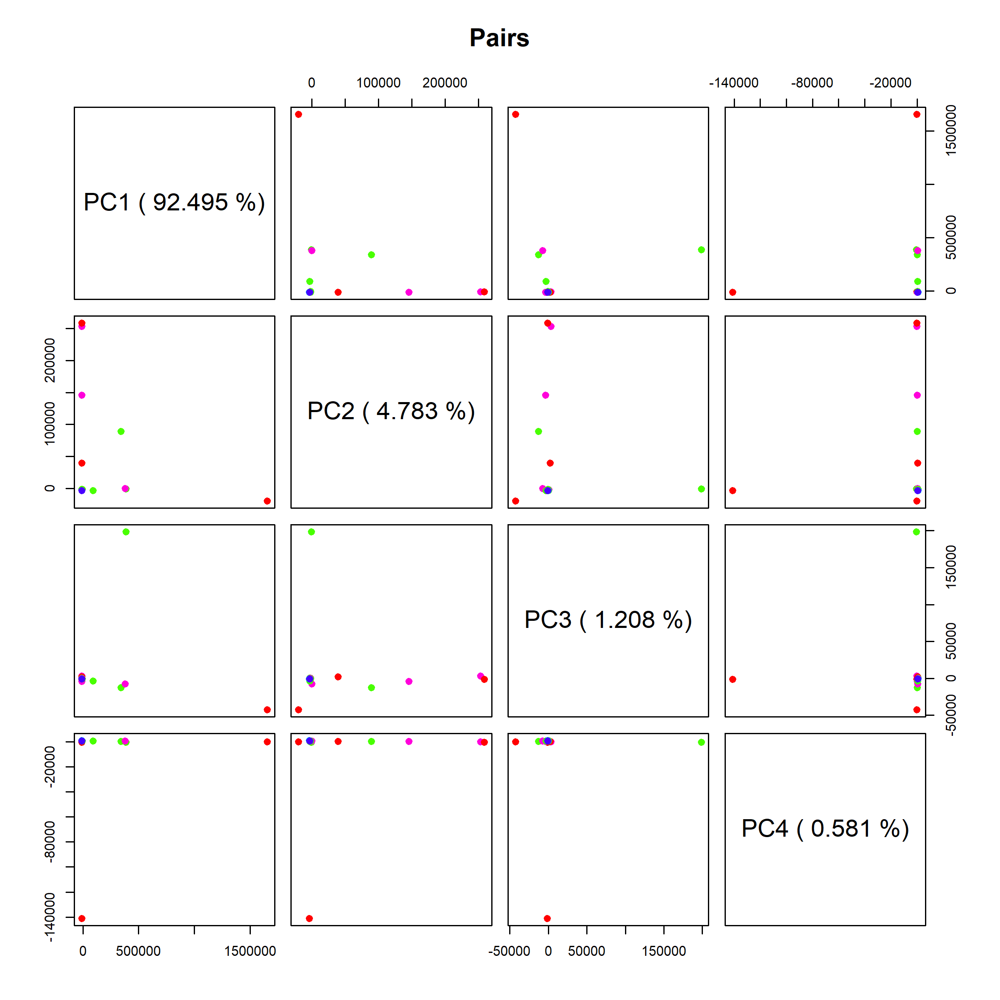
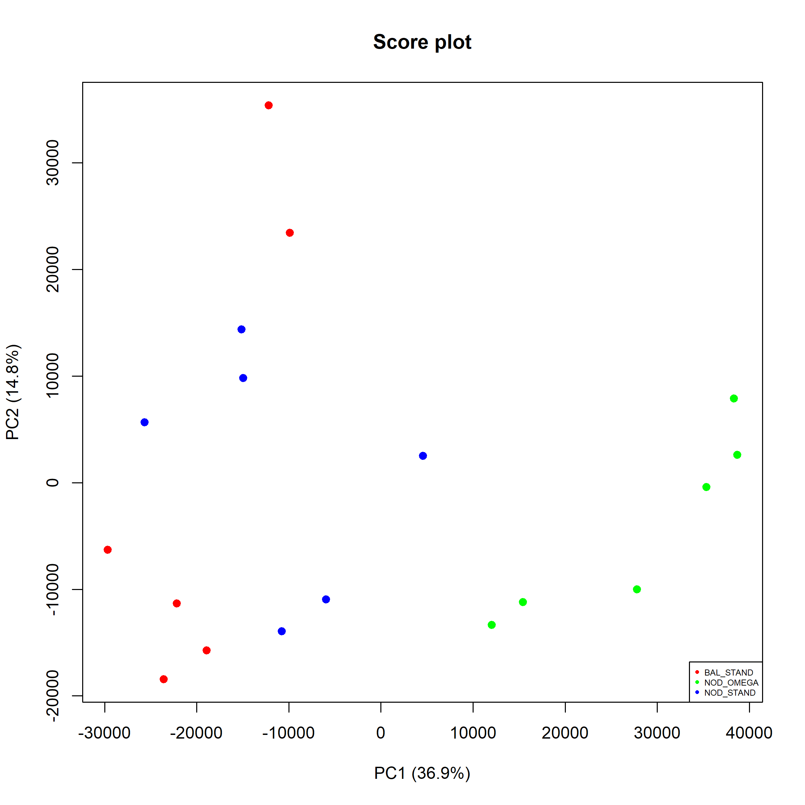
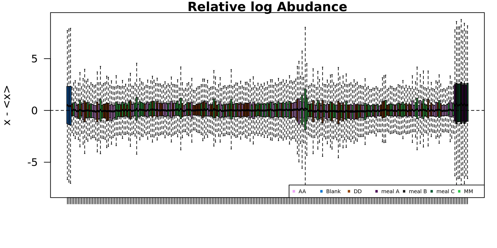
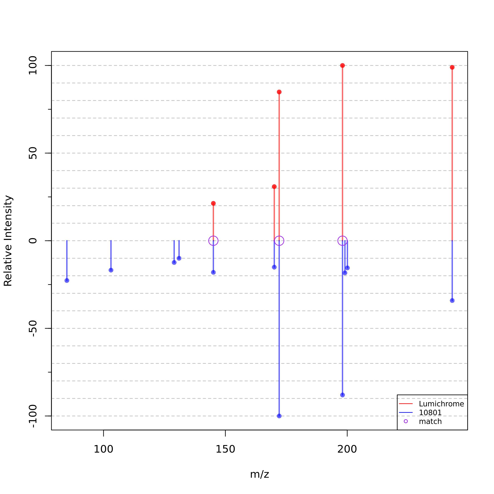
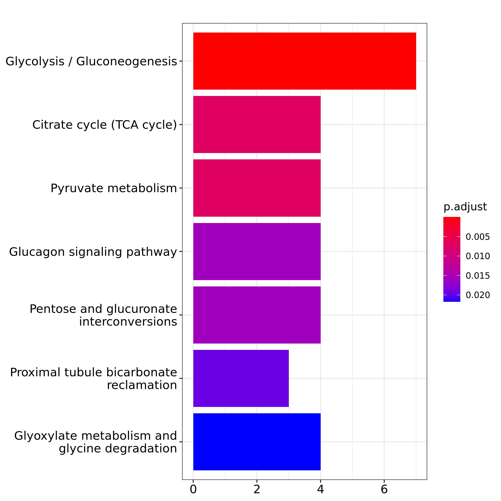

```{r, include=F, message=FALSE, warning=FALSE, eval=T}
devtools::load_all()
```

# Introduction

Untargeted metabolomics allows acquisition of thousands metabolite signals in a single sample that demands computational techniques for post-acquisition steps. Web-based data processing solutions as well as R packages exist and provide tools for metabolomics data analysis. Frequently these tools cover only a part of the entire workflow thus requiring the use of different platforms. Moreover, despite the existence of several databases, metabolite identification remains the bottleneck in metabolomics due to the high variability in the fragmentation pattern resulting from different mass spectrometer configuration-based libraries.

margheRita covers the whole data analysis workflow in LC-MS/MS untargeted metabolomics experiments, using MS and MS/MS (even SWATH) data. It takes in input the results of data extraction generated by [MS-Dial](http://prime.psc.riken.jp/compms/msdial/main.html) [@Tsugawa2015] and metadata for sample processing (in text or Excel format).

The package provides:

- a series of pre-processing functions (quality control, filtering and normalization) with a particular focus on methods specifically recommended for metabolomic profiles, such as filtering by mass defects, filtering by coefficient of variation (samples vs QCs) and probabilistic quotient normalization;
- metabolite annotation up to level-1, based on in-house spectral libraries as well as freely available libraries;
- spectral libraries that covers 4 different chromatographic column types: RP-C18, HILIC, RP-C8 and pZIC-HILIC Zwitterionic.
- simplified execution of parametric and non-parametric statistical tests over a large number of features;
- pathway analysis based on ORA and MSEA over various databases.

The R package margheRita is developed thanks to the collaboration between:

- Proteomics and Metabolomcis Facility, HSR;
- COSR, HSR;
- Bioinformatics Lab, CNR-ITB.

Contacts:

- [Annapaola Andolfo](https://research.hsr.it/en/core-facilities/promefa/annapaola-andolfo.html), Proteomics and Metabolomcis Facility, HSR
- [Ettore Mosca](https://www.itb.cnr.it/en/institute/staff/ettore-mosca), Bioinformatics Lab, CNR-ITB

{width=30%}

# Installation

The package can be installed using devtools:
```{r, eval=FALSE}
if (!requireNamespace("devtools", quietly = TRUE)) {
  install.packages("devtools")
}
devtools::install_github("emosca-cnr/margheRita", dependencies = T)
```

# Input data

margheRita is intended to be used after having done a number of data acquisition steps through MS-Dial [@Tsugawa2015]. It requires two inputs in text or Excel format:

- **feature data file**, which must include feature identifiers, m/z values, retention times, MS/MS spectra and feature abundances across samples;
- **sample annotation file**, which must include the following mandatory columns: "id", "injection_order", "batch", "class", "biological_rep" and "technical_rep".

The function `'`read_input_file()`'` allows the user to import input data into the "mRList" object, a data structure ("mRList") that is used in margheRita:

```{r, eval=FALSE}
mRList <- read_input_file(input = "path/to/your/data.xlsx", metadata = "path/to/your/metadata.xlsx", data_start_col=5, rt_col=2, mz_col=3, MS_MS_column=4, type = "Excel")
```
```{r echo=FALSE}
lapply(mRList_demo$raw, function(x) head(x[, 1:5]))
```

The initial mRList object contains the following elements:

Objects in mRList  | Description
------------- | -------------
data  | matrix containing metabolite intensity
metab_ann  | metabolite annotation
sample_ann | sample annotation
QC | matrix containing metabolite intensity for QC
QC_ann | QC annotation

Most of margheRita functions operates on an mRList object and returns a modified version  of it, possibly with additional elements.

# Quality control, filitering and normalization

## Filtering low quality metabolites and samples

The step of pre-processing data is crucial in order to filter missing and not accurate values. margheRita has three function for preprocessing data.

filter_NA function checks missing values in the experimental data.
If missing values are > 80% of the measured values, feature is trashed, otherwise missing values have to be imputed with imputation function.


```{r, eval=FALSE}
mRList_filt <- filter_NA(mRList = mRList_filt, min_metab_in_sample = 100, min_sample_with_metab = 10)
```

Imputation function provides to impute missing value of each feature replacing NA with a random number, calculated as the 10% and 25% of the minimum value of the feature. 

```{r, eval=FALSE}
mRList_imp <- imputation(mRList, seed=NULL, a=0.1, b=0.25)

```

m/z function filters features with m/z value not accurate. Values with the first decimal place comprises between 4 and 8 are excluded as they are not accurate.

```{r, eval=FALSE}
mRList_filt <- m_z_filtering(mRList = mRList, lower_quality_mass_acc = 0.4,
                             upper_quality_mass_acc = 0.8, do_plot = T, 
                             color="black")

```

This function generates a heatscatter plot, using `heatscatter()` function exploiting the package [LSD](https://cran.r-project.org/web/packages/LSD/index.html). The plot is a representation of the chromatography (for one or more samples):

```{r, eval=FALSE}
heatscatter_chromatography(mRList = mRList)
```

{width=100%}

## Principal Component Analysis 

margheRita performs Principal Component Analysis (PCA) using the function `mR_pca()`, which relies on the package pca_methods [@Stacklies2007]. Besides choosing the scaling method (argument `scaling`) and number of PCs (`nPcS`), it allows to include/exclude quality control samples by means of argument `include_QC`:

```{r , eval=F}
mRList <- mR_pca(mRList = mRList, nPcs=5, scaling="uv", include_QC=FALSE)
```
The results are added to the mRList in the element `pca`. It also provides some plots, like the visualization of distribution of loadings for all-pairs of the top 5 PCs.

{width=80%}
The results of PCA can be plotted using `Plot2DPCA()` function. The argument `col_by` enables the choice of the `mRList$sample_ann` column to be used to color samples:

```{r, eval=FALSE}
Plot2DPCA(mRList = mRList, pcx=1, pcy=2, col_by="class", include_QC=TRUE)
```

{width=80%}

## Normalization

margheRita provides three ways for normalizing metabolite profiles: 

- "log", the log2 of metabolite abundances;
- "reference", every sample is divided by a reference value;
- "pqn", probabilistic quotient normalization [@Dieterle2006]; 

For "reference" and "pqn" methods, the column `reference` must be present in `mRList$metab_ann`. The function `calc_reference()` sets up such column using average metabolite values. By default, it uses the median of QC samples:

```{r, eval=FALSE}
mRList <- calc_reference(mRList)
```
```{r echo=FALSE}
head(mRList_demo$norm$metab_ann)
```
For example, here's a call to `normalize_profiles` using pqn:
```{r, eval=FALSE}
mRList_norm <- normalize_profiles(mRList, method = "pqn")
```

## Filter by coefficient of variation

The comparison of the coefficient of variation of a metabolite in relation to QC samples provides a means to exclude low quality features. In particular, only features that have a CV ratio between no-QC samples and QC sample higher than a given threshold (by default `ratioCV=1`) are kept:

```{r, eval=FALSE}
mRList <- CV_ratio(mRList = mRList, ratioCV=1)
```

## Relative log abundace

The distributions of metabolite relative log-abundances can be calculated and visualized by means of:

```{r, eval=FALSE}
mRList <- RLA(mRList = mRList)
```
Typically, after normalization, the various samples should have similar distributions of relative log-abundances.
{width=100%}


## Removing samples

It is common that the inspection of the similarity between samples (e.g. distribution over the top PCs, RLA) rise concerns about the quality of some samples. The function `remove_samples()` allows the user to remove one or more samples from the `mRList`. Here, for example we remove all "Blank" samples:

```{r, eval=FALSE}
mRList <- remove_samples(mRList = mRList, ids = "Blank", column = "class")
```

In this case, the function removes all samples with value "Blank" in the column "class" of sample annotation.

## Collapse technical replicates

The definition of mean metabolite abundance for every biological replicate is performed by means of `collapse_tech_rep()` function:

```{r,eval=FALSE}
mRList <- collapse_tech_rep(mRList = mRList)
```

# Descriptive statistics and inferential tests

MargheRita provides a some functions to calculate mean and variability, fold changes and to test for metabolite variations.

## Descriptive statistics

The function `mean_median_stdev_samples()` calculates mean, median and standard deviation of metabolites according to the sample classes specified in the column "class" of sample annotation:

```{r, eval=FALSE}
mRList <- mean_median_stdev_samples(mRList = mRList)
```

Differential intensity analysis works on collapsed data, data frame has to contain only biological replicates, hence before calculating fold change (FC) collapse_tech_rep function has to be launch. Results were reported in metab_ann. margheRita implements differential abundance analysis by using the fold change index: $log_2(\frac{\bar{B}}{\bar{A}})$ where $\bar{B}$ and $\bar{A}$ are the second and the first term of the specified ratio, respectively. 

Within margheRita regarding this context are implemented two functions: calculate_lfc_all, that calculates log2 FC among all useful pairwise comparisons, calculate_lfc, that calculates log2 FC indicating the couple of samples to compare.

The function calculate_lfc_all calculates log2 fold change for all $m/z$ features, among all useful pairwise comparisons. The threshold, for the upper and lower values, has to be specified in lfc_threshold, by default threshold is set at 0.25. 

```{r, eval=FALSE}
mRList <- calculate_lfc_all(mRList = mRList, lfc_threshold = 0.25)
```

If the user is interested into a specific contrast, comparing two specific groups and not all if you have more than two groups under study, calculate_lfc functions has to be used. Indeed in addition to lfc_threshold, in this function, also the names of the two groups to compare has to be specified as vector, as parameter of contrast_samples. 

```{r, eval=F}
mRList <- calculate_lfc(mRList = mRList, lfc_theshold = 0.25, contrast_samples = c("BAL_STAND", "NOD_STAND"))

```

## Statistical tests

The function `norm_check()` uses Shapiro-Wilk's test to assess whether feature abundances are normally distributed. Features with $p>\alpha$ can be considered normally distributed.

```{r, eval=FALSE}
mRList <- norm_check(mRList = mRList)
```

The function `univariate()` performs univariate statistical tests between biological replicates (hence it requires an mRList on which `collapse_tech_rep()` was run).Available tests are: Student t-test, Wilcoxon test, Anova and Kruskal-Wallis test.

```{r, eval=FALSE}
mRList <- univariate(mRList = mRList, test_method=c( "anova"), exp.levels = c("AA", "DD", "MM"), exp.factor = "class")
```

## Visualization of metabolite levels

In addition to the plots related to PCA, margheRita provides also boxplots and heatmaps to graph results. The function `metab_boxplot()` draws boxplots of the features of interest or all. Boxplots can be drawn for all the features, it takes time according to the number of features, or for only features of interest, indicated in the parameter features as vector.

```{r, eval=FALSE}
metab_boxplot(mRList = mRList, col_by="class", group="class")
```

This function allows to draw boxplot and report p-value calculated using Student t test. The function `h_map()` provides heatmaps based on package ComplexHeatmap [@Gu2016]:

```{r, eval=FALSE}
h_map(mRList = mRList, scale_features=TRUE, top=500)
```

# Metabolite identification

Metabolite identification in margheRita is performed by means of the function `metabolite_identification()`, which requires an mRList object and a reference library with MS and MS/MS metabolite information. The identification is possible up to level-1, provided that the required information are available in the reference library. The identification is based on the quantification of the following quantities:

- retention time (RT) error: $$\epsilon_t(i) = |t(i) - t^*(i)|$$
- ppm error: $$\epsilon_m(i) = \frac{|m(i) - m^*(i)|}{m^*(i)} \cdot 10^6$$
- percent relative intensity error: $$\epsilon_{I_R}(i,j) = \frac{|I_R(i,j) - I^*(i,j)|}{I^*_R(i,j)} \cdot 100$$

Such quantities are used to score the similarity among precursors of features and metabolites, as well as their MS/MS spectra.

The function `select_library()` provides a means to select any of two sources:

- **margheRita**, which contains MS and MS/MS information for about 800 metabolites spanning several biological functions; these libraries provideup to level 1 identifications in positive and negative modalities for "HILIC", "LipC8", "pZIC", "RPLong" and "RPShort" chromatographic columns;

- **MS-Dial**, which covers a much larger set of metabolites ($10^5$), but is limited to level 2 identifications in positive and negative modalities.

In this example, we load the margheRita library in positive modalitity with retention times of RPShort columns and we discard all peaks with relative intensity less than 10:

```{r, eval=FALSE}
mR_library <- select_library(column = "RPShort", mode = "POS", accept_RI=10)
```

The resulting `mR_library` is a list that contains information about precursors
```{r echo=FALSE}
mRList_demo$library$lib_precursor
```
and MS/MS peaks 
```{r echo=FALSE}
mRList_demo$library$lib_peaks[1:3]
```
Once the library is selected, metabolite identification can be performed by the homonymous function, where the argument `features` specifies the features to be considered (all features if it is left `features=NULL`, as in the following example):
```{r, eval=FALSE}
mRList <- metabolite_identification(mRList = mRList, library_list = mR_library, features=NULL)
```
The function `metabolite_identification()` has a series of parameters that can be adjusted to optimize the identification process (see its documentation). By default, all association that met the considered criteria are returned. When metabolite identification is applied on a large number of features (e.g., $10^3$), it's common to obtain multiple features associated with the same metabolite and the opposite (1 feature, multiple metabolites). This redundancy can be addressed setting `filter=TRUE`. In this case, firstly, the various features associated with the same metabolite are filtered considering the best association based on the following priority:

1. "Level" ("Level_note"): the identification level, in the order: 1, 2, 3 (mz, rt), 3 (mz);
2. "mass_status": precursor ppm error class, in the order: super, acceptable, suffer;
3. "peaks_found_ppm_RI": number of matching peaks in MS/MS spectra, in decreasing order
4. "RT_class": precursor RT error class, in the order: super, acceptable.

Then, multiple metabolites associated with the same feature are filtered considering the best association based on the same priority. The resulting associations with full details of the analysis are stored in `mRList$metabolite_identification$associations`:

```{r echo=FALSE}
head(mRList_demo$norm$metabolite_identification$associations)
```

A summary of the associations is available in `mRList$metabolite_identification$associations_summary`:

```{r echo=FALSE}
head(mRList_demo$norm$metabolite_identification$associations_summary)
```

Lastly, the associations are used to add metabolite information to `mRList$metab_ann` (here, we omit MS/MS spectra for the sake of brevity):

```{r echo=FALSE}
mRList_demo$norm$metab_ann[, -c(4:5)]
```

## Visualization of spectral similarity

The spectra from all the features that match a metabolite can be inspected creating the following plot through:

```{r, eval=FALSE}
visualize_associated_spectra(mRList = mRList, mR_library = mR_library, metabolite_id = "L709")
```

{width=80%}

# Retriving statistics for identified metabolites

The results of statistical test and metabolite identification can be merged using the function `merge_stats_with_features()`. The argument `feature_stats` should be the name of any statistical test saved in the `mRList` or a custom data frame with Feature_ID as row names:

```{r, eval=FALSE}
sig_metab_t <- merge_stats_with_features(mRList = mRList, feature_stats = "ttest")
```

```{r echo=FALSE}
head(mRList_demo$sig_metab)
```


# Pathway analysis

margheRita implements both Over Representation Analysis (ORA) and Metabolite Set Enrichment Analysis (MSEA), based on clusterProfiler [@Wu2021] over BioCyc, KEGG and Reactome pathway databases. These analyses can be run by means of function `pathway_analysis()`, which takes as input a vector of PubChemCID or a ranked list of PubChemCID in case of ORA or MSEA respectively:

```{r, eval=FALSE}
pa_res <- pathway_analysis(sig_metab, type = "ora", universe = metab_universe)
msea_res <- pathway_analysis(ranked_metab_vector, type = "msea", universe = metab_universe)
```

The result is a list that contains (i) a table with pathway descriptions and (ii) an object of class "enrichResult", which can be used to obtain various visualizations through clusterProfiler functions.

{width=80%}


# References

