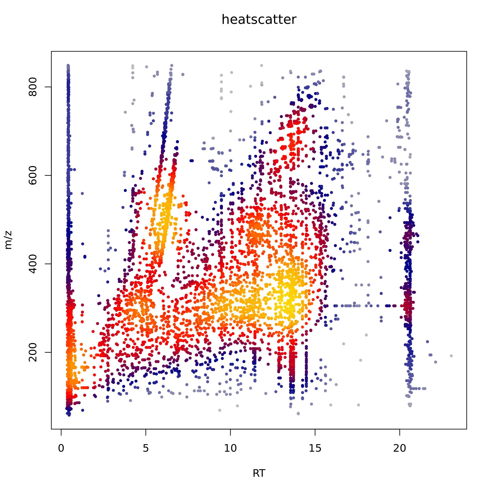

```{r setup, include = FALSE}
knitr::opts_chunk$set(
  collapse = TRUE,
  comment = "#>"
)
```
{width=30%}

**Author's Affiliations**

**1**. ProMeFa, Proteomics and Metabolomics Facility, Center for Omics Sciences (COSR), IRCCS San Raffaele Scientific Institute, Milan 20132, Italy

**2**. Center for Omics Sciences (COSR), IRCCS San Raffaele Scientific Institute, Milan 20132, Italy

**3**. University of Milan, Milan, Italy

**4**. National Research Council, Institute of Biomedical Technologies, Segrate (Milan), Italy

## Introduction

MargheRita is intended for any kind of mass spectrometer raw data, including both $MS$ and $MS/MS$ data. It takes as input `.txt/.csv`or `.xlsx` files that contain the metabolic profiles generated by **[MS-Dial](http://prime.psc.riken.jp/compms/msdial/main.html)** and metadata for sample processing. The first pre-processing step performs the integration of the metabolic profiles in a unique data structure and generates plots for quality control about outliers, drifts or batch effects. Then, metabolites and samples can be filtered based on the quantification of mass defect values, missing values and coefficient of variation of m/z features along QC and study samples. Moreover, margheRita provides various methods for missing value imputation and data normalization, including those particular recommended for metabolomic profiles, like the Probabilistic Quotient Normalization (PQN) or the normalization to a standard factor (e.g. protein concentration, urine osmolality). Subsequent analyses include: parametric and non-parametric statistical tests for the identification of significant metabolite signatures; sample clustering; metabolite correlation analysis and pathway analysis (using databases like **[KEGG](https://www.genome.jp/kegg/)** and **[Biocyc](https://biocyc.org)**). Additional advantage derives from the $MS/MS$ data management and annotations with the possibility of data browsing and searching.

## Getting started

The package can be installed using devtools:
```{r, eval=FALSE}
if (!requireNamespace("devtools", quietly = TRUE)) {
  install.packages("devtools")
}
devtools::install_github("emosca-cnr/margheRita", dependencies = T)
```


## Reading input files

The function `read_input_file()` allows you to import the dataset and its relative metadata creating margheRita object "mRList", other parameters that can be specified are:

* `split_QC`: Boolean, whether to split QC samples from the others or not (default: FALSE).

* `rt_col`: integer parameter, it specifies the number of the column that corresponds to retention time.

* `mz_col`: the same for `rt_col`, but for the $m/z$ corresponding column

* `data_start_col`: integer parameter that specifies the number of the

Currently margheRita includes two datasets. To load the first one, "example1", run:
```{r, eval=FALSE}
input_data_file <- system.file("extdata", "example1.xlsx", package = "margheRita")
input_metadata_file <- system.file("extdata", "example1_meta.xlsx", package = "margheRita")
mRList <- read_input_file(input = input_data_file, metadata = input_metadata_file, split_QC = TRUE, rt_col = 2, mz_col =3 , data_start_col = 4)
```
To load the second, a dataset where metabolite intensities show a drift realated to injection order, run:
```{r, eval=FALSE}
input_data_file <- system.file("extdata", "dataset_drift.xlsx", package = "margheRita")
input_metadata_file <- system.file("extdata", "dataset_drift_metadata.xlsx", package = "margheRita")
mRList <- read_input_file(input_data_file, metadata = input_metadata_file, data_start_col = 8, rt_col = 2, mz_col = 3)
```
 

The mRList object has this structure:

Objects in mRList  | Description
------------- | -------------
data  | matrix containing metabolite intesity
metab_ann  | metabolite annotation
sample_ann | sample annotation
QC | matrix containing metabolite intesity for QC
QC_ann | QC annotation

Importantly, the mRList can be translated into `metaboset` or `MSnSet` classes:
```{r, eval=FALSE}
mset <- as.metaboset.mRList(mRlist)
msnset <- as.MSnSet.mRList(mRlist)
```

## Preprocessing

margheRita provides filters on the basis of $m/z$ and missing values:

```{r, eval=FALSE}
mRList_filt <- m_z_filtering(m_list = mRlist, lower_quality_mass_acc = 0.4, upper_quality_mass_acc = 0.8, do_plot = T, color="black")
mRList_filt <- filter_NA(mRList_filt)

```

* `m_list`: mRlist object.

* `lower_quality_mass_acc`: floating parameter, it specifies the lower number associated to the firt $m/z$ feature decimal number that will be cut off.

* `upper_quality_mass_acc`: floating parameter, it specifies the upper number associated to the firt $m/z$ feature decimal number that will be cut off.

* `do_plot`: Boolean parameter that specifies if a distribution plot of $m/z$ feature has to be displayed

* `color`: character specifying the color of the curve. 

<!-- function output produce in metab_ann a column called quality: 
```{r, eval=FALSE}
head(m_list$metab_ann, 5)
```
-->

### Heatscatter_Cromatography
This function provide an overview of all the $m/z$ features in all experiments during all the chromatogram, by generating a Heatscatter plot using `LSD::heatscatter()` function exploiting **[LSD package](https://cran.r-project.org/web/packages/LSD/index.html)**
```{r, eval=FALSE}
heatscatter_chromatography(mRList, mz_limits = NULL, rt_limits = NULL, sample = NULL)
```
* `sample`: character parameter, default value is `NULL`, if specified in the plot will be provided only $m/z$ feature present in that specific sample.

* `mz_limits`: vector parameter, default value is `NULL`, that specifies the minimum and maximum value of the $m/z$ features window that have to be displayed.

* `rt_limits`: vector parameter, default value is `NULL`, that specifies the minimum and maximum value of the retenction time window that have to be displayed.

{width=100%}


### Principal Component Analysis

pca_gen function allows to perform Principal Component Analysis (PCA). Specific parameters are:

* `include_QC` = if quality control (QC) samples have to be added in the PCA analysis.  Default =TRUE (QCs are considered)
* `scaling` = different types of scaling can be chosen by user: Pareto, UV or none. Users have to specify the type of scaling.
* `write_output`= if tables, as .csv format, have to be saved. Default=FALSE
* `col_by` = define how to color the samples: by class, timepoint, etc.

```{r , eval=F}
pca_gen(mRList, col_by = "class")
```
{width=100%}


### Normalization
Currently, margheRita provides three ways for normalizing metabolite profiles:

* `log`: log2-normalization;

* `reference`: every sample is divided by a reference value;

* `pqn`: probabilistic quotient normalization.

Here's the code for using PQN:

```{r, eval=FALSE}
mRList <- calc_reference(mRList)
mRList_norm <- normalize_profiles(mRList, method = "pqn")
```

### Descriptive stastistics
mean_median_stdev_samples function allows to retrieve principal descriptive statistics indexes for all $m/z$ features, in particular function retrieves for all features across all different group the intensities mean, median and standard deviation.
```{r, eval=FALSE}
m_list <- mean_media_stdev_samples(m_list, write_output = F)
```
The collapse_tech_rep function calculates the mean of the technical replicates for each biological replicate. The outputs are data and metadata without technical replicates but with biological replicates only.

### Filter by coefficient of variation

CV function calculates the coefficient of variation for each metabolite for samples and QC, separately, to assess the precision and repeatability of the measurement. 
CV is calculated using the following equation:$CV= (stdev/mean)*100$
If $CV QC > CV sample$ metabolite is deleted. The outputs are data and metab_ann with the only reliable metabolites. 


## Univariate and Multivariate analysis

### Differential intensity analysis
margheRita implements the of differential abundance analysis by using the fold change index: $log_2(\frac{\bar{B}}{\bar{A}})$ where $\bar{B}$ and $\bar{A}$ are the second and the first term of the specified contrast,respectively. Within margheRita regarding this context are implemented two functions:
```{r, eval=FALSE}
m_list <- calculate_lfc_all(m_list = m_list, lfc_theshold = 0.25)
```
This function allow to perform for all $m/z$ feature the fold change, among all useful pairwise comparisons, the specifiable parameters of the function are:
* `lfc_theshold`: an integer representing the fold change upper which the corresponding negative value and lower which the corresponding positive value, a $m/z$ is considered significative or not, (so for example if a user specifies `lfc_theshold=0.25` all $-0.25<log_2(Fold Change)>+0.25$ are consider not significative and the function assign value 0).
If the user is interest to a specific contrast a second function in witch you can specify was constructed:
```{r, eval=F}
m_list <- calculate_lfc(m_list = m_list, lfc_theshold = 0.25, contrast_samples = c("BAL_STAND", "NOD_STAND"))

```
* `contrast_samples`: is a character vector of samples specified in the metadata.


### Univariate analysis

The normality check function uses Shapiro-wilk's test to check the normality of each metabolite. The output is a list of p-values for each metabolite. If p-value<0.05 metabolite is not normally distributed, if p-value>0.05 metabolite is normally distributed.

## Metabolite identification

Metabolite identification is based on a level-1 library contaning about 800 metabolites spanning several biological functions. The identification follows these steps:

* precursor RT;

* precursor ppm error;

* ppm errors of ions;

* relative intensity of ions.


## Pathway analysis
margheRiuta implements both Over Representation Analysis and Metabolite Set Enrichmenet Analysis relying on clusterProfiler and NCBI Biosystems.

### ORA
A toy example of ORA considering as input metabolite list, the metabolites belonging to the Glycolysis pathways (id=82926) and other 10 randomly selected metabolites:
```{r, eval=FALSE}
  #ORA Example
  metab_list <- unique(c(bsid2cid$CID[bsid2cid$bs_id=="82926"], sample(unique(bsid2cid$CID), 10))) #glycolysis
  res_ora <- pathway_analysis(in_list = metab_list, universe = metabolite_annotation$PubChem.CID, minGSSize = 5)
```

{width=100%}


## Data Visualization

metab_boxplot draws boxplots of metabolites/features all or metabolites of interest. h_map draws the heatmap of metabolites/features

