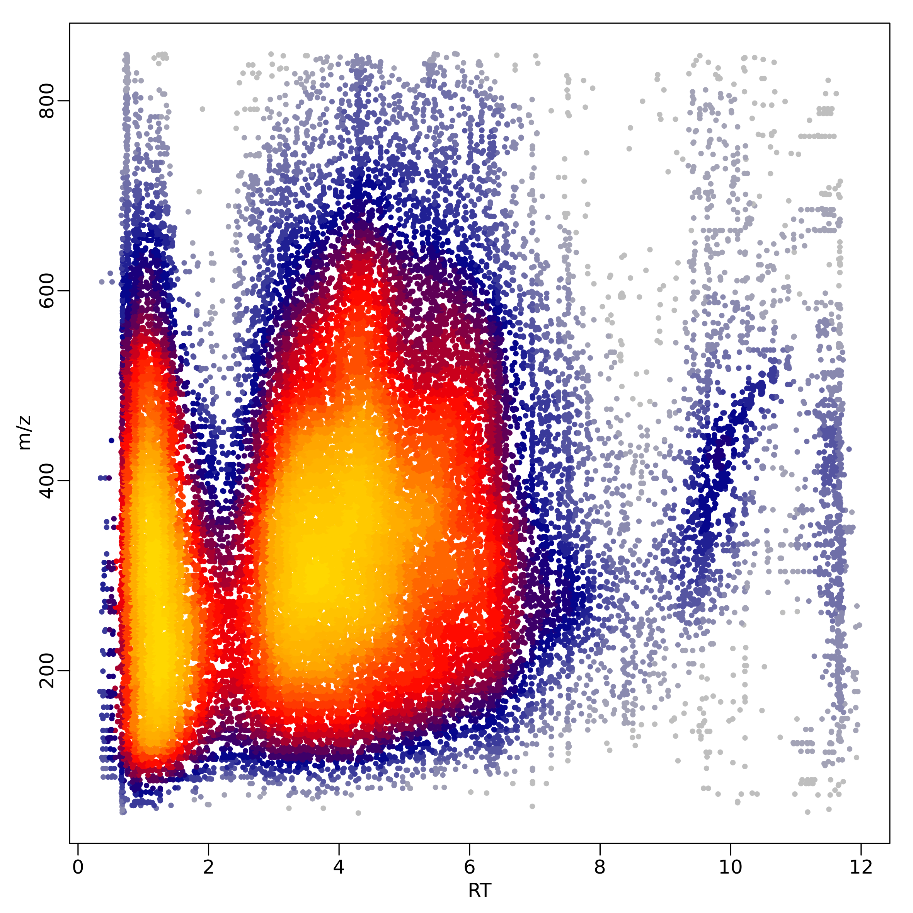
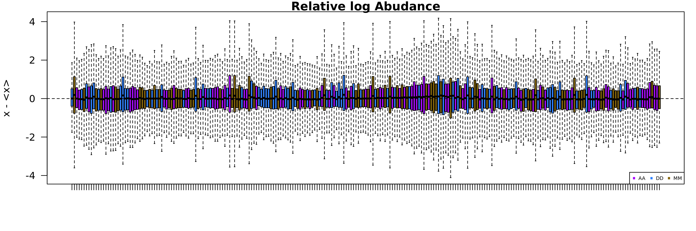
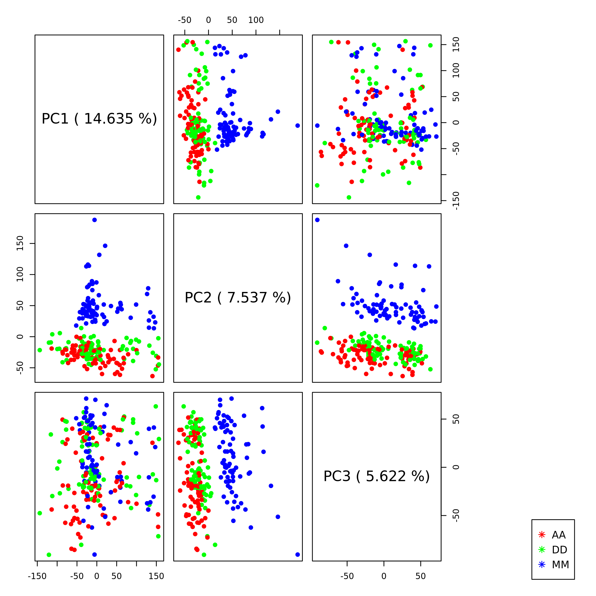
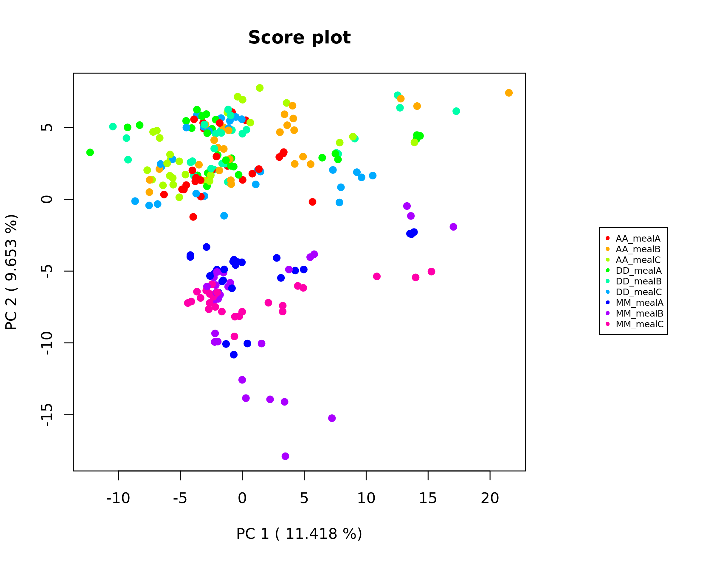
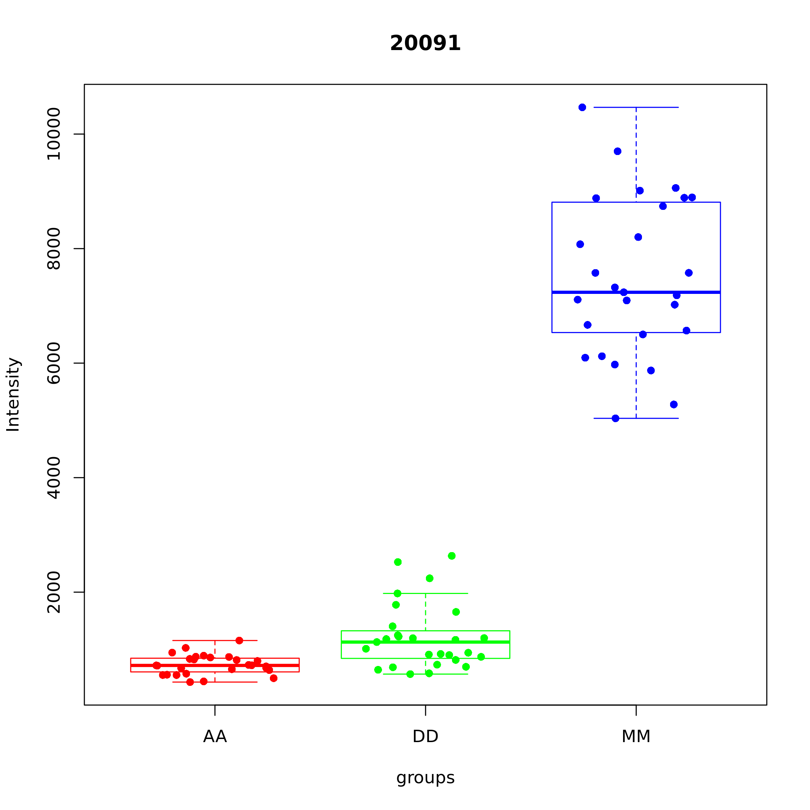
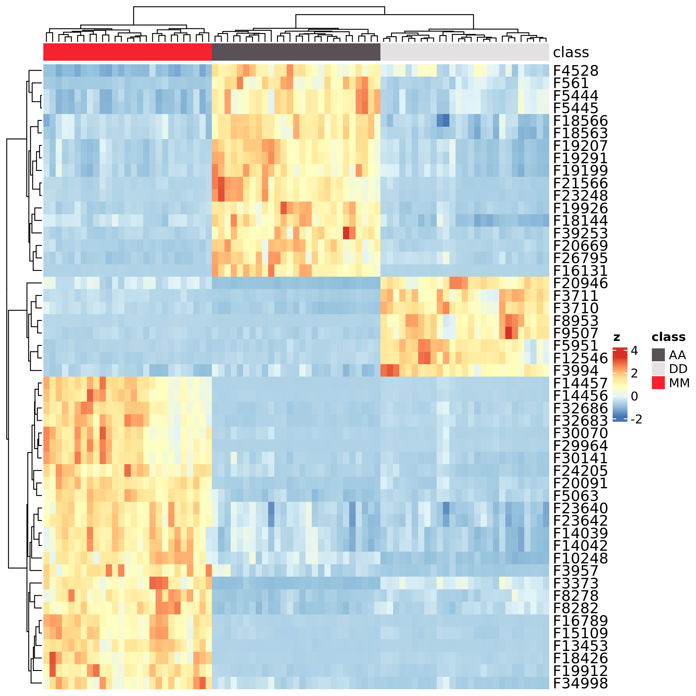
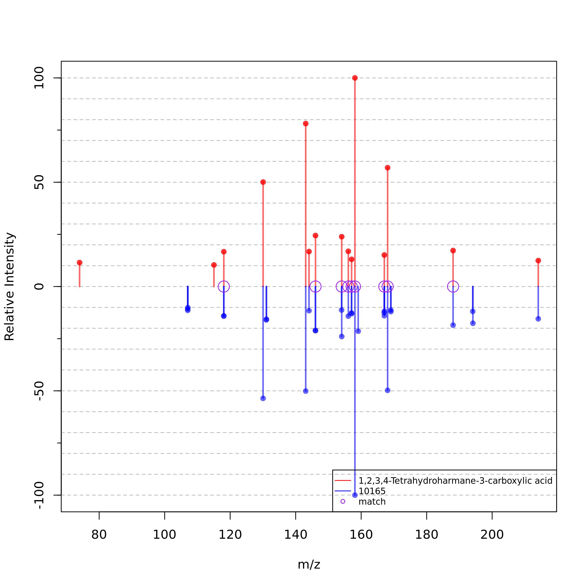
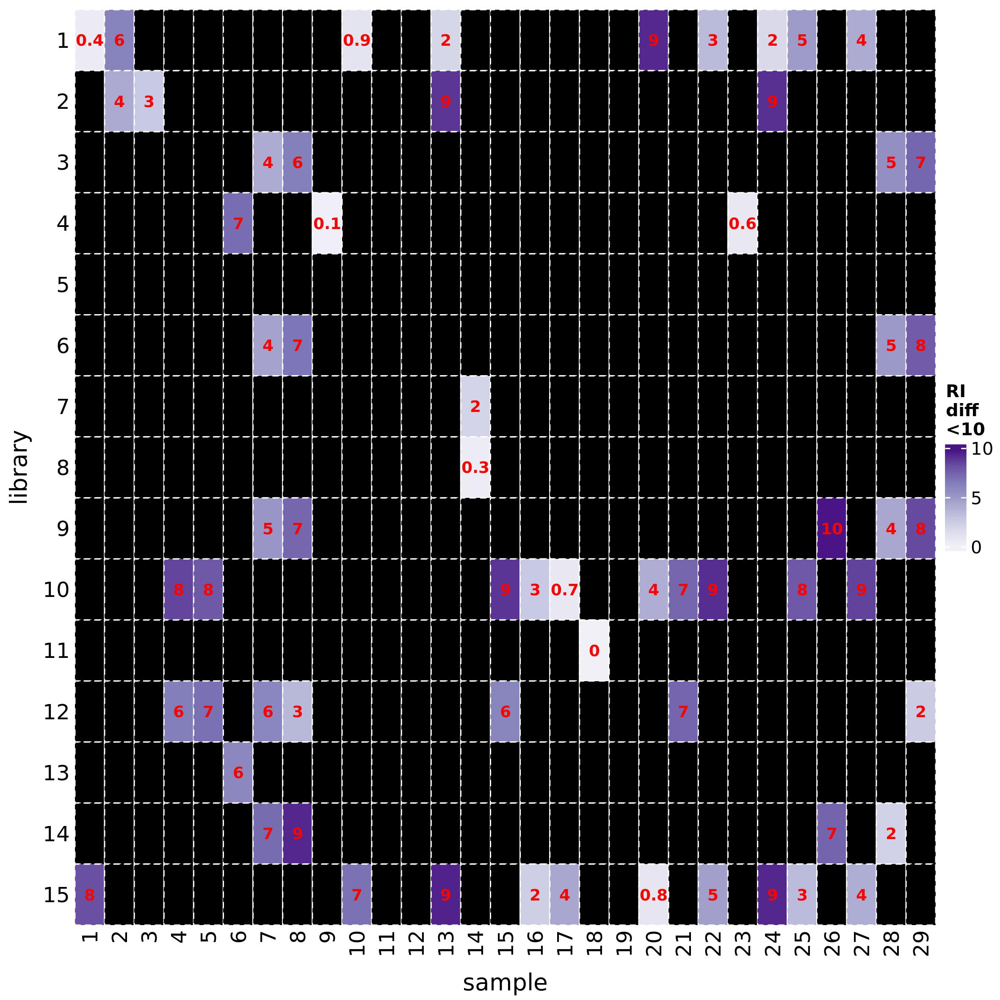
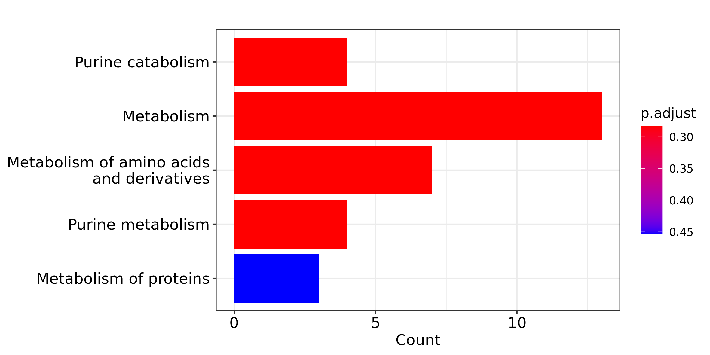

```{r, include=F, message=FALSE, warning=FALSE, eval=T}
devtools::load_all()
```

{width=30%}

# Introduction

Untargeted metabolomics allows acquisition of thousands metabolite signals in a single sample that demands computational techniques for post-acquisition steps. Web-based data processing solutions as well as R packages exist and provide tools for metabolomics data analysis. Frequently these tools cover only a part of the entire workflow thus requiring the use of different platforms. Moreover, despite the existence of several databases, metabolite identification remains the bottleneck in metabolomics due to the high variability in the fragmentation pattern resulting from different mass spectrometer configuration-based libraries.

margheRita covers the whole data analysis workflow in LC-MS/MS untargeted metabolomics experiments, using MS and MS/MS (even SWATH) data. It takes in input the results of data extraction generated by [MS-Dial](http://prime.psc.riken.jp/compms/msdial/main.html) [@Tsugawa2015] and metadata for sample processing (in text or Excel format).

The package provides:

- a series of pre-processing functions (quality control, filtering and normalization) with a particular focus on methods specifically recommended for metabolomic profiles, such as filtering by mass defects, filtering by coefficient of variation (samples vs QCs) and probabilistic quotient normalization;
- metabolite annotation up to level-1, based on in-house spectral libraries as well as freely available libraries;
- spectral libraries that covers 4 different chromatographic column types: RP-C18, HILIC, RP-C8 and pZIC-HILIC Zwitterionic.
- simplified execution of parametric and non-parametric statistical tests over a large number of features;
- pathway analysis based on ORA and MSEA over various databases.

The R package margheRita is developed thanks to the collaboration between:

- Proteomics and Metabolomcis Facility, HSR;
- COSR, HSR;
- Bioinformatics Lab, CNR-ITB.

Contacts:

- [Annapaola Andolfo](https://research.hsr.it/en/core-facilities/promefa/annapaola-andolfo.html), Proteomics and Metabolomcis Facility, HSR
- [Ettore Mosca](https://www.itb.cnr.it/en/institute/staff/ettore-mosca), Bioinformatics Lab, CNR-ITB


# Installation

The package can be installed using devtools:
```{r, eval=FALSE}
if (!requireNamespace("devtools", quietly = TRUE)) {
  install.packages("devtools")
}
devtools::install_github("emosca-cnr/margheRita", dependencies = T)
```

# Input data

margheRita is intended to be used after having done a number of data acquisition steps through MS-Dial [@Tsugawa2015]. It requires two text files in tab-delimited format:

- **feature data file**, which must include feature identifiers, m/z values, retention times, MS/MS spectra and feature abundances across samples; usually, this file is generated by MS-Dial;
- **sample annotation file**, which must include the following mandatory columns: "id", "injection_order", "batch", "class", "biological_rep" and "technical_rep".

Usingh such two files, the function `read_input_file()` creates the "mRList" object, which is used by most of the margheRita functions as main input/output:

```{r, eval=FALSE}
mL <- read_input_file(feature_file = "MS-Dial_file.txt", sample_file = "sample_info.txt")
```

Please, also consider that, to properly split QC samples, you must indicate exactly "QC" as class of a sample in the sample_file.

The initial mRList object contains the following elements:

Element of the mRList  | Description
------------- | -------------
data  | matrix containing metabolite abundances
metab_ann  | metabolite annotation
sample_ann | sample annotation
QC | matrix containing metabolite abundances of QC samples
QC_ann | annotation of QC samples

```{r echo=FALSE}
lapply(mL_demo$raw, head)
```

# Filtering, imputation and normalization

The function `filtering()` runs filters to exclude features/sample with many missing values, features with wrong m/z values and, lastly, performs imputation of missing values:

```{r, eval=FALSE}
mL <- filtering(mL)
```

These three steps can be called independently through the function `filter_NA()`, `m_z_filtering()` and `imputation()`, respectively. In particular, `m_z_filtering()` remove features with m/z that have decimal value within [4, 8] (by default), while the imputation is performed replacing NA values with a random number, calculated between 10%-25% of the minimum value of the feature. 

The function `heatscatter_chromatography()` creates a graphic overview of the mz and rt values in the dataset:

```{r, eval=FALSE}
heatscatter_chromatography(mL)
```

{width=100%}

margheRita provides three ways for normalizing metabolite profiles: 

- "log", the log2 of metabolite abundances;
- "reference", every sample is divided by a reference value;
- "pqn", probabilistic quotient normalization [@Dieterle2006]; 

For "reference" and "pqn" methods, the column `reference` must be present in `mRList$metab_ann`. If missing, the function `calc_reference()` sets up such column using average metabolite values and medians of QC samples. For example, here's a call to `normalize_profiles()` using pqn:
```{r, eval=FALSE}
mL_norm <- normalize_profiles(mL, method = "pqn")
```

The comparison of the coefficient of variation of a metabolite in relation to QC samples provides a means to exclude low quality features. In particular, only features that have a CV ratio between no-QC samples and QC sample higher than a given threshold (by default 1) are kept:

```{r, eval=FALSE}
mL_norm <- CV_ratio(mRList = mL_norm)
```

The distributions of metabolite relative log-abundances can be calculated and visualized by means of:

```{r, eval=FALSE}
mL <- RLA(mRList = mL)
```
Typically, after normalization, the various samples should have similar distributions of relative log-abundances.
{width=100%}


# Principal Component Analysis 

margheRita performs Principal Component Analysis (PCA) using the function `mR_pca()`, which relies on the package pca_methods [@Stacklies2007]. Besides choosing the scaling method (argument `scaling`) and number of PCs (`nPcS`), it allows to include/exclude quality control samples by means of argument `include_QC`:

```{r , eval=F}
mL_norm <- mR_pca(mRList = mL_norm, nPcs=5, scaling="uv", include_QC=FALSE)
```
The results are added to the mRList in the element `pca`. It also provides some plots, like the visualization of distribution of loadings for all-pairs of the top 5 PCs. The plots are directly saved in the current working directory (or in the sub directory created with the argument `dirout`)

{width=100%}
The results of PCA can be plotted using `Plot2DPCA()` function. The argument `col_by` enables the choice of the `mRList$sample_ann` column to be used to color samples:

```{r, eval=FALSE}
Plot2DPCA(mRList = mL_norm, pcx=1, pcy=2, col_by="class", include_QC=TRUE)
```

{width=80%}


# Removing samples and collapsing techincal replicates

It is common that the inspection of the similarity between samples (e.g. distribution over the top PCs, RLA) rise concerns about the quality of some samples. The function `remove_samples()` allows the user to remove one or more samples from the `mRList`. Here, for example we remove all "Blank" samples:

```{r, eval=FALSE}
mL <- remove_samples(mRList = mL, ids = "Blank", column = "class")
```

In this case, the function removes all samples with value "Blank" in the column "class" of sample annotation.

The definition of mean metabolite abundance for every biological replicate is performed by means of `collapse_tech_rep()` function:

```{r, eval=FALSE}
mL_norm_bio <- collapse_tech_rep(mRList = mL_norm)
```

```{r echo=FALSE}
lapply(mL_demo$bio, head)
```

# Statistical analysis

MargheRita provides some functions to calculate mean and variability, fold changes and to test for metabolite variations.

The function `mean_median_stdev_samples()` calculates mean, median and standard deviation of metabolite abundance according to the sample classes specified in the column "class" of sample annotation:

```{r, eval=FALSE}
mean_median_stdev_samples(mL_norm_bio)
```

The function `univariate()` performs dataset-wide statistical tests (Student t-tests, Wilcoxon test, Anova and Kruskal-Wallis test) between levels of a particular factor defined in the sample annotation:

```{r, eval=FALSE}
mL_norm_bio <- univariate(mL_norm_bio, test_method="anova", exp.levels = c("AA", "DD", "MM"), exp.factor = "class")
```
```{r echo=FALSE}
head(mL_demo$anova)
```

The function `metab_boxplot()` draws boxplots of feature abundances grouped by the levels of a given factor:

```{r, eval=FALSE}
metab_boxplot(mRList = mL_norm_bio, col_by="class", group="class", features = 1)
```
{width=80%}

This function allows to draw boxplot and report p-value calculated using Student t test. The function `h_map()` provides heatmaps based on package ComplexHeatmap [@Gu2016]:

```{r, eval=FALSE}
h_map(mL_norm_bio)
```
{width=80%}

# Metabolite identification

Metabolite identification in margheRita is performed by means of the function `metabolite_identification()`, which requires an mRList object and a reference library with MS and MS/MS metabolite information. The identification is possible up to level-1, provided that the required information are available in the reference library. The identification is based on the quantification of the following quantities:

- retention time (RT) error: $$\epsilon_t(i) = |t(i) - t^*(i)|$$
- ppm error: $$\epsilon_m(i) = \frac{|m(i) - m^*(i)|}{m^*(i)} \cdot 10^6$$
- percent relative intensity error: $$\epsilon_{I_R}(i,j) = \frac{|I_R(i,j) - I^*(i,j)|}{I^*_R(i,j)} \cdot 100$$

Such quantities are used to score the similarity among precursors of features and metabolites, as well as their MS/MS spectra.

The function `select_library()` provides a means to select any of two sources:

- **margheRita**, which contains MS and MS/MS information for about 800 metabolites spanning several biological functions; these libraries provideup to level 1 identifications in positive and negative modalities for "HILIC", "LipC8", "pZIC", "RPLong" and "RPShort" chromatographic columns, that are acquired following the methods reported in the supplementary material of Mosca et al. (manuscript in preparation).

- **MS-Dial**, which covers a much larger set of metabolites ($10^5$), but is limited to level 2 identifications in positive and negative modalities.

In this example, we load the margheRita library in positive modalitity with retention times of RPShort columns and we discard all peaks with relative intensity less than 10:

```{r, eval=FALSE}
mR_library <- select_library(column = "RPShort", mode = "POS", accept_RI=10)
```

The resulting `mR_library` is a list that contains information about precursors
```{r echo=FALSE}
mL_demo$library$lib_precursor
```
and MS/MS peaks 
```{r echo=FALSE}
mL_demo$library$lib_peaks
```
Once the library is selected, metabolite identification can be performed by the homonymous function, where the argument `features` specifies the features to be considered (all features if it is left `features=NULL`, as in the following example):
```{r, eval=FALSE}
mL_norm_bio <- metabolite_identification(mL_norm_bio, library_list = mR_library)
```
The function `metabolite_identification()` has a series of parameters that can be adjusted to optimize the identification process (see its documentation). By default, all association that met the considered criteria are returned. When metabolite identification is applied on a large number of features (e.g., $10^3$), it's common to obtain multiple features associated with the same metabolite and the opposite (1 feature, multiple metabolites). This redundancy can be addressed setting `filter=TRUE`. In this case, firstly, the various features associated with the same metabolite are filtered considering the best association based on the following priority:

1. "Level" ("Level_note"): the identification level, in the order: 1, 2, 3 (mz, rt), 3 (mz);
2. "mass_status": precursor ppm error class, in the order: super, acceptable, suffer;
3. "peaks_found_ppm_RI": number of matching peaks in MS/MS spectra, in decreasing order
4. "RT_class": precursor RT error class, in the order: super, acceptable.

Then, multiple metabolites associated with the same feature are filtered considering the best association based on the same priority. The resulting associations with full details of the analysis are stored in `mL_norm_bio$metabolite_identification$associations`:

```{r echo=FALSE}
mL_demo$metab_assoc
```

A summary of the associations is available in `mL_norm_bio$metabolite_identification$associations_summary`:

```{r echo=FALSE}
mL_demo$metab_assoc_summ
```

Lastly, the associations are used to add metabolite information to `mL_norm_bio$metab_ann` (here, we omit MS/MS spectra for the sake of brevity):

```{r echo=FALSE}
mL_demo$metab_annoted
```

The spectra from all the features that match a metabolite can be inspected creating the following plot through:

```{r, eval=FALSE}
visualize_associated_spectra(mRList = mL_norm_bio, mR_library = mR_library, metabolite_id = "L1660")
```

{width=80%}

The function `h_map_MSMS_comparison()` draws heatmaps to visually compare ppm errors and RI differences between feature and metabolite spectra:

```{r, eval=FALSE}
h_map_MSMS_comparison(mL_norm_bio, metab_id = "L1660", feature_id = "10165")
```

{width=80%}
{width=80%}

# Retriving statistics for identified metabolites

The results of statistical test and metabolite identification can be merged using the function `merge_stats_with_features()`. The argument `feature_stats` should be the name of any statistical test saved in the `mRList` or a custom data frame with Feature_ID as row names:

```{r, eval=FALSE}
sig_metab <- merge_stats_with_features(mRList = mL_norm_bio, feature_stats = "anova")
```

```{r echo=FALSE}
mL_demo$sig_metab
```


# Pathway analysis

margheRita implements both Over Representation Analysis (ORA) and Metabolite Set Enrichment Analysis (MSEA), based on clusterProfiler [@Wu2021] over BioCyc, KEGG and Reactome pathway databases. These analyses can be run by means of function `pathway_analysis()`, which takes as input a vector of PubChemCID or a ranked list of PubChemCID in case of ORA or MSEA respectively:

```{r, eval=FALSE}
pa_res <- pathway_analysis(sig_metab, type = "ora", universe = metab_universe)
```

The result is a list that contains (i) a table with pathway descriptions and (ii) an object of class "enrichResult", which can be used to obtain various visualizations through clusterProfiler functions.

```{r echo=FALSE}
mL_demo$ora
```


{width=80%}

# Inter-operability

We provide two functions to map the mRList into data structures used by other packages, which provide complementary functionalities:

- `as.metaboset()` produces a "MetaboSet" object, used by package "notame" [@Klavus2020];

- `as.PomaSummarizedExperiment()` produces a "PomaSummarizedExperiment" object, used by package "POMA" [@Castellano2021].

# References

