```{r, include=F, message=FALSE, warning=FALSE, eval=T}
devtools::load_all()
```

{width=30%}

# Introduction

Untargeted metabolomics studies by mass spectrometry technologies generate huge numbers of metabolite signals, requiring computational analyses for post-acquisition processing and dedicated databases for metabolite identification. Web-based data processing solutions frequently include only a part of the entire workflow thus implying the use of different platforms. The R package margheRita addresses the complete workflow for metabolomic profiling in untargeted studies based on liquid chromatography (LC) coupled with tandem mass spectrometry (MS/MS). This pipeline is specially advantageous in the case of data-independent acquisition (DIA), where all MS/MS spectra are acquired with high resolution. Interestingly, the R package margheRita enhances fragment matching accuracy by providing an original metabolite spectral library acquired in both polarities using different chromatographic columns.

The package provides:

- a series of pre-processing functions (quality control, filtering and normalization) with a particular focus on methods specifically recommended for metabolomic profiles, such as filtering by mass defects, filtering by coefficient of variation (samples vs QCs) and probabilistic quotient normalization;
- metabolite annotation up to level-1, based on in-house spectral libraries as well as freely available libraries;
- spectral libraries that covers 4 different chromatographic column types: RP-C18, HILIC, RP-C8 and pZIC-HILIC Zwitterionic.
- simplified execution of parametric and non-parametric statistical tests over a large number of features;
- pathway analysis based on ORA and MSEA over various databases.

Source code: https://github.com/emosca-cnr/margheRita

Citation:  Ettore Mosca, Marynka Ulaszewska, Zahrasadat Alavikakhki, Edoardo Niccolò Bellini, Valeria Mannella, Gianfranco Frigerio, Denise Drago, Annapaola Andolfo. MargheRita: an R package for LC-MS/MS SWATH metabolomics data analysis and confident metabolite identification based on a spectral library of reference standards. bioRxiv 2024.06.20.599545; doi: https://doi.org/10.1101/2024.06.20.599545


Contacts:

- [Annapaola Andolfo](https://research.hsr.it/en/core-facilities/promefa/annapaola-andolfo.html), Proteomics and Metabolomics Facility, HSR
- [Ettore Mosca](https://www.itb.cnr.it/en/institute/staff/ettore-mosca), Bioinformatics Lab, CNR-ITB

# Installation

The package requires a series of other R packages, which are available in [CRAN](https://cran.r-project.org/), [Bioconductor](https://www.bioconductor.org/) or [github](https://github.com/), namely:

```{r, echo=FALSE}
cat(packageDescription("margheRita")$Imports)
```

In most of the cases, the following instructions guarantee that all such dependencies are installed:

```{r, eval=FALSE}
install.packages("devtools")

if (!require("BiocManager", quietly = TRUE)){
  install.packages("BiocManager")
}
BiocManager::install(c("Biobase", "ComplexHeatmap", "clusterProfiler", "pcaMethods"))

devtools::install_github("emosca-cnr/margheRita", dependencies = T)
```

## Optional packages

The functions `as.metaboset()` and `as.PomaSummarizedExperiment()` enable margheRita data structure export in formats that are compatible with, respectively, packages [notame](https://github.com/antonvsdata/notame) and [POMA](https://www.bioconductor.org/packages/release/bioc/html/POMA.html). If interested in these functions the user must install such packages:

```{r eval=FALSE, message=FALSE}
BiocManager::install("POMA")
devtools::install_github("antonvsdata/notame")
```

# Input data

margheRita is intended to be used after having done a number of data acquisition steps through MS-Dial [@Tsugawa2015]. It requires two text files in tab-delimited format:

- **feature data file**, which must include feature identifiers, m/z values, retention times, MS/MS spectra and feature abundances across samples; usually, this file is generated by MS-Dial;
- **sample annotation file**, which must include the following mandatory columns: "id", "injection_order", "batch", "class", "biological_rep" and "technical_rep".

A couple of **remarks**:
 
- short sample ids yield better figures;

- the collapse of technical replicates (see below) takes place over all samples that share the same concatenation of "class" and "biological_rep" values.

The function `read_input_file()` read the two files and creates the "mRList" object, which is used by most of the margheRita functions as main input/output:

```{r, eval=FALSE}
mL <- read_input_file(feature_file = "MS-Dial_file.txt", sample_file = "sample_info.txt")
```

Please, also consider that, to properly split QC samples, you must indicate exactly "QC" as class of a sample in the sample_file.

The initial mRList object contains the following elements:

Element of mRList  | Description
------------- | -------------
data  | matrix containing metabolite abundances
metab_ann  | metabolite annotation
sample_ann | sample annotation
QC | matrix containing metabolite abundances of QC samples
QC_ann | annotation of QC samples

```{r echo=FALSE}
head(mL_demo$raw$data[, 1:3])
head(mL_demo$raw$metab_ann[, 1:5])
head(mL_demo$raw$sample_ann)
head(mL_demo$raw$QC[, 1:3])
head(mL_demo$raw$QC_ann)
```

The full version of the "Urine" dataset, which was used for margheRita assessment and to generate this documentation, is available at https://doi.org/10.5281/zenodo.11243781, files "Urine_RP_NEG_norm.txt" and "Urine_RP_POS_norm.txt". The corresponding sample information files can be accessed as follows:

```{r, eval=FALSE}
sample_file_NEG <- system.file("extdata", "Urine_RP_NEG_norm_metadata.txt", package = "margheRita")
sample_file_POS <- system.file("extdata", "Urine_RP_POS_norm_metadata.txt", package = "margheRita")
```

# Inter-operability

To support interoperability with other packages with a focus on metabolomics, the margheRitaList can be reorganized as a "MetaboSet" object, used by package "notame" [@Klavus2020] (see above the installation instruction to enable this opportunity):

```{r, eval=FALSE, message=FALSE}
ms <- as.metaboset(mRList)
```
```{r, eval=T, echo=F, message=FALSE}
mL_demo$ms
```
or as “PomaSummarizedExperiment” object, used by package "POMA" [@Castellano2021]:
```{r, eval=FALSE, message=FALSE}
se <- as.PomaSummarizedExperiment(mRList)
```
```{r eval=T, echo=F, message=FALSE}
mL_demo$se
```

# Filtering and normalization

The function **`filtering()`** runs filters to exclude features/sample with many missing values, features with wrong m/z values and, lastly, performs imputation of missing values:

```{r, eval=FALSE}
mL <- filtering(mL)
# Samples with >= 100 metabolites 243 / 243 
# Features occurring in >=  3 samples 604 / 604 
# Features with appropriate m/z values: 548 
# Features without appropriate m/z values: 56 
No NAs: imputation not performed.
```

These three steps can be called independently through the function `filter_NA()`, `m_z_filtering()` and `imputation()`, respectively. In particular, `m_z_filtering()` remove features with m/z that have decimal value within [4, 8] (by default), while the imputation is performed replacing NA values with a random number, calculated between 10%-25% of the minimum value of the feature. 


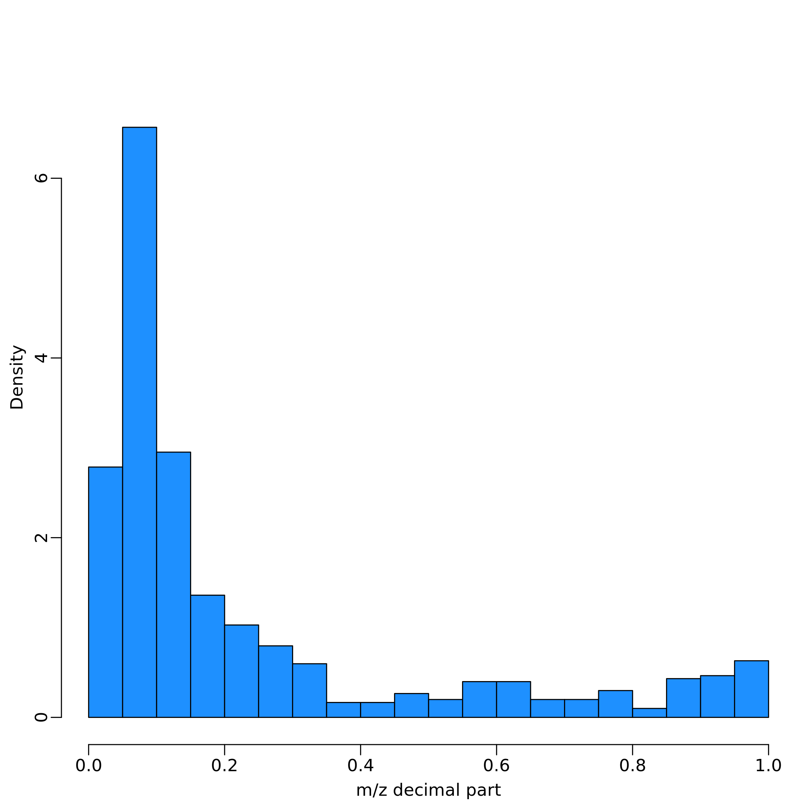{width=49%} 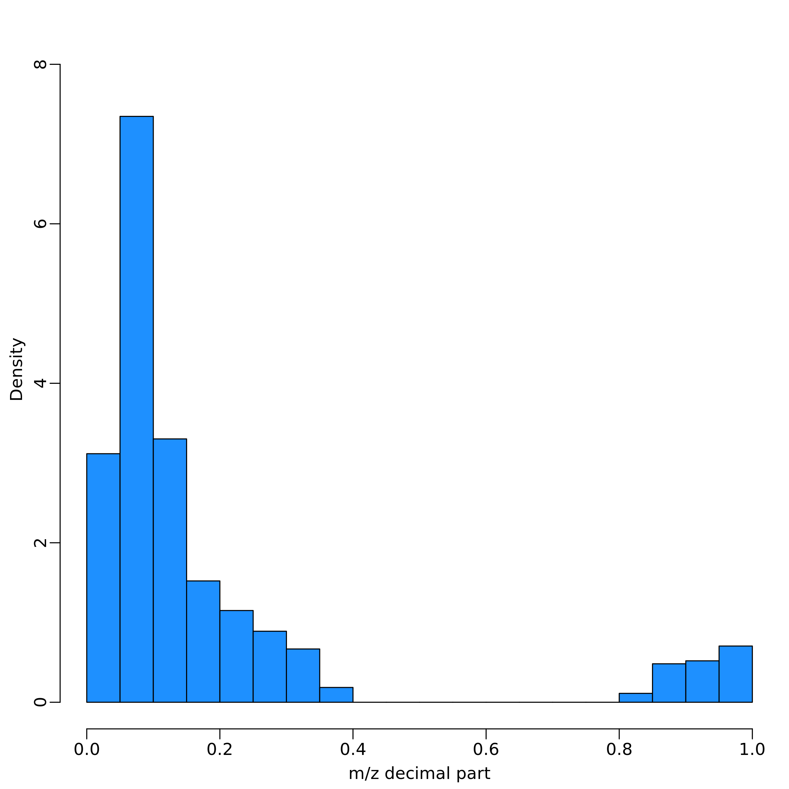{width=49%}


The function `heatscatter_chromatography()` creates a graphic overview of the mz and rt values in the dataset:

```{r, eval=FALSE}
heatscatter_chromatography(mL)
```

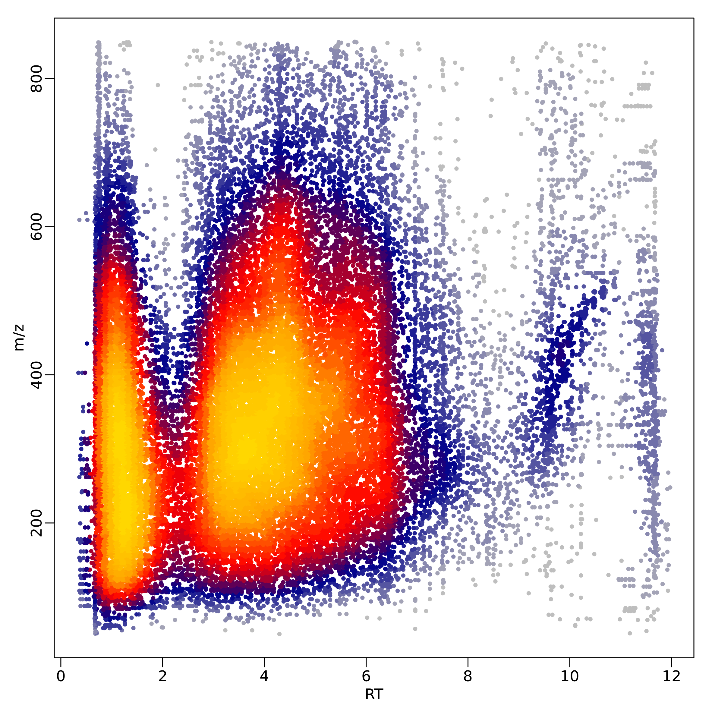{width=100%}

margheRita provides three ways for **normalizing** metabolite profiles: 

- "log", the log2 of metabolite abundances;
- "reference", every sample is divided by a reference value;
- "pqn", probabilistic quotient normalization [@Dieterle2006]; 

For "reference" and "pqn" methods, the column `reference` must be present in `mRList$metab_ann`. If missing, the function `calc_reference()` sets up such column using average metabolite values and medians of QC samples. For example, here's a call to `normalize_profiles()` using pqn:
```{r, eval=FALSE}
mL_norm <- normalize_profiles(mL, method = "pqn")
PQN normalization
No reference profile found, using calc_reference() function...
Using QC...
```

The comparison of the coefficient of variation of a metabolite in relation to QC samples provides a means to exclude low quality features. In particular, only features that have a CV ratio between no-QC samples and QC sample higher than a given threshold (by default 1) are kept:

```{r, eval=FALSE}
mL_norm <- CV_ratio(mRList = mL_norm)
Summary of CV ratio (samples / QC):
   Min. 1st Qu.  Median    Mean 3rd Qu.    Max. 
 0.3593  0.8025  1.1032  1.4645  1.6516 13.4896 
# Metabolites with appropriate CV 303 / 539 
```

The distributions of metabolite relative log-abundances can be calculated and visualized by means of:

```{r, eval=FALSE}
mL <- RLA(mRList = mL)
```

Typically, after normalization, the various samples should have similar distributions of relative log-*abundance*, a powerful tool to visualize unwanted variation in high-dimensional data [@Gandolfo2017].
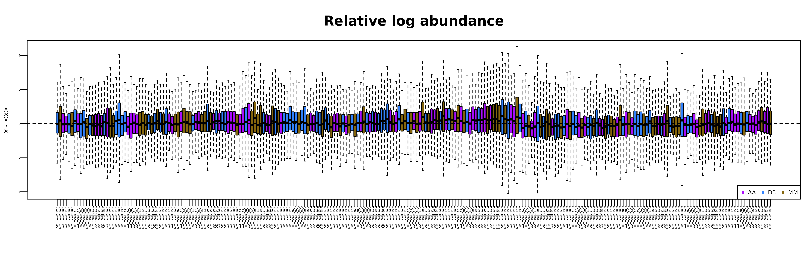{width=100%}


# Principal Component Analysis 

margheRita performs Principal Component Analysis (PCA) using the function `mR_pca()`, which relies on the package pca_methods [@Stacklies2007]. Besides choosing the scaling method (argument `scaling`) and number of PCs (`nPcS`), it allows to include/exclude quality control samples by means of argument `include_QC`:

```{r , eval=F}
mL_norm <- mR_pca(mRList = mL_norm, nPcs=5, scaling="uv", include_QC=FALSE)
```
The results are added to the mRList in the element `pca`. It also provides some plots, like the visualization of distribution of loadings for all-pairs of the top 5 PCs. The plots are directly saved in the current working directory (or in the sub directory created with the argument `dirout`). The results of PCA can be plotted using `Plot2DPCA()` function. The argument `col_by` enables the choice of the `mRList$sample_ann` column to be used to color samples:

```{r, eval=FALSE}
Plot2DPCA(mRList = mL_norm, pcx=1, pcy=2, col_by="class", include_QC=TRUE)
```

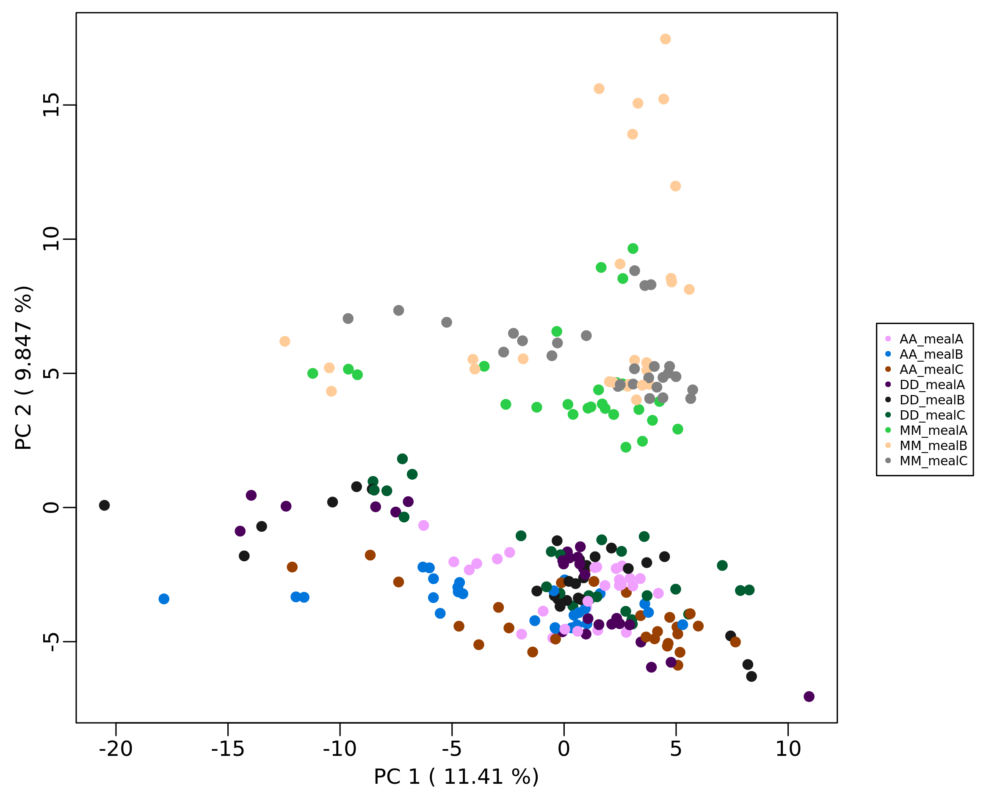{width=100%}

# Removing samples

It is common that the inspection of the similarity among samples (e.g. distribution over the top PCs, RLA) rises concerns about the quality of some sample. The function `remove_samples()` allows the user to remove one or more samples from the `mRList`. Here, for example we remove all "Blank" samples:

```{r, eval=FALSE}
mL <- remove_samples(mRList = mL, ids = "Blank", column = "class")
```

In this case, the function removes all samples with value "Blank" in the column "class" of sample annotation.

# Collapsing techinical replicates

The definition of mean metabolite abundance for every biological replicate is performed by means of `collapse_tech_rep()` function:

```{r, eval=FALSE}
mL_norm_bio <- collapse_tech_rep(mRList = mL_norm)
```

```{r echo=FALSE}
head(mL_demo$bio$data[, 1:5])
head(mL_demo$bio$sample_ann)
```

# Statistical analysis

MargheRita provides some functions to calculate mean and variability, fold changes and to test for metabolite variations.

The function `mean_median_stdev_samples()` calculates mean, median and standard deviation of metabolite abundance according to the sample classes specified in the column "class" of sample annotation:

```{r, eval=FALSE}
mean_median_stdev_samples(mL_norm_bio)
According to dataset size, this might take a few minutes.
Calculating means...
Calculating medians...
Calculating standard deviations...
```

The function `univariate()` performs dataset-wide statistical tests (Student t-tests, Wilcoxon test, Anova and Kruskal-Wallis test) between levels of a particular factor defined in the sample annotation:

```{r, eval=FALSE}
mL_norm_bio <- univariate(mL_norm_bio, test_method="anova", exp.levels = c("AA", "DD", "MM"), exp.factor = "class")
```
```{r echo=FALSE}
head(mL_demo$anova)
```

The full results of the analysis are saved to the text file <test_method>.txt.

We found useful providing a function to retrieve the list of significant features:

```{r, eval=FALSE}
significant_features <- select_sign_features(mL_norm_bio, test_method="anova", test_value = "q", cutoff_value = 0.05)
```
```{r echo=FALSE}
head(mL_demo$significant_features)
```

# Metabolite identification

Metabolite identification in margheRita is performed by means of the function `metabolite_identification()`, which requires an mRList object and a reference library with MS and MS/MS metabolite information. The identification is possible up to level-1, provided that the required information are available in the reference library. The identification is based on the quantification of the following quantities:

- retention time (RT) error: $$\epsilon_{rt}(i) = |t(i) - t^*(i)|$$
- ppm error: $$\epsilon_{m/z}(i) = \frac{|x(i) - x^*(i)|}{x^*(i)} \cdot 10^6$$
- percent relative intensity error: $$\epsilon_{I}(i,j) = \frac{|I(i,j) - I^*(i,j)|}{I^*(i,j)} \cdot 100$$

Such quantities are used to score the similarity among precursors of features and metabolites, as well as their MS/MS peaks.

## Spectral library

The function `select_library()` provides a means to select any of two sources:

- **margheRita**, which contains MS and MS/MS information for about 800 metabolites spanning several biological functions; these libraries provideup to level 1 identifications in positive and negative modalities for "HILIC", "LipC8", "pZIC", "RPLong" and "RPShort" chromatographic columns, that are acquired following the methods reported in the supplementary material of @Mosca2024.

- **MS-Dial**, which covers a much larger set of metabolites ($10^5$), but is limited to level 2 identifications in positive and negative modalities.

In this example, we load the margheRita library in positive modality with retention times of RPShort columns and we discard all peaks with relative intensity less than 10:

```{r, eval=FALSE}
mR_library <- select_library(column = "RPShort", mode = "POS", accept_RI=10)
```

The resulting `mR_library` is a list that contains metadata and MS information about precursors
```{r echo=FALSE}
mL_demo$library$lib_precursor
```
and MS/MS peaks 
```{r echo=FALSE}
mL_demo$library$lib_peaks
```

## Identification

Once the library is selected, metabolite identification can be performed by the homonymous function, where the argument `features` specifies the features to be considered (all features if it is left `features=NULL`, as in the following example):
```{r, eval=FALSE}
mL_norm_bio <- metabolite_identification(mL_norm_bio, library_list = mR_library)
```
The function `metabolite_identification()` has a series of parameters that can be adjusted to optimize the identification process (see its documentation). When metabolite identification is applied on a large number of features (e.g., $10^4$), it is common to obtain many-to-many associations between features and metabolite. By default, this redundancy is addressed following an algorithm that considers the classification (Level 1, Level 2, Level 3a and Level 3b), the errors (see above) and a series of quantitative and qualitative scores (see below and @Mosca2024 for further details). This function adds/modifies the following items in the mRList and saves each of them to a sheet of the xlsx file "metabolite_identification.xlsx":

- `mL_norm_bio$metabolite_identification$associations`: all the resulting associations (sheet "associations")

```{r echo=FALSE}
mL_demo$metab_assoc
```

- `mL_norm_bio$metabolite_identification$associations_summary`: a summary of the associations ("summary"):

```{r echo=FALSE}
mL_demo$metab_assoc_summ
```

- `mL_norm_bio$metab_ann`: columns are added with main annotation info for each feature (here below we omit MS/MS spectra column for clarity) ("metab_ann"):

```{r echo=FALSE}
mL_demo$metab_annoted
```

- `mL_norm_bio$data_ann` ("data_ann"): the column "Name" is added :

```{r echo=FALSE}
mL_demo$data_ann
```

Importantly, **the feature-metabolite association filtering can be disabled** (e.g. for exploratory analysis) setting `filter=FALSE`.

## Visualization

The spectra from all the features that match a metabolite can be inspected creating the following plot:

```{r, eval=FALSE}
visualize_associated_spectra(mRList = mL_norm_bio, mR_library = mR_library, metabolite_id = "L1660")
```

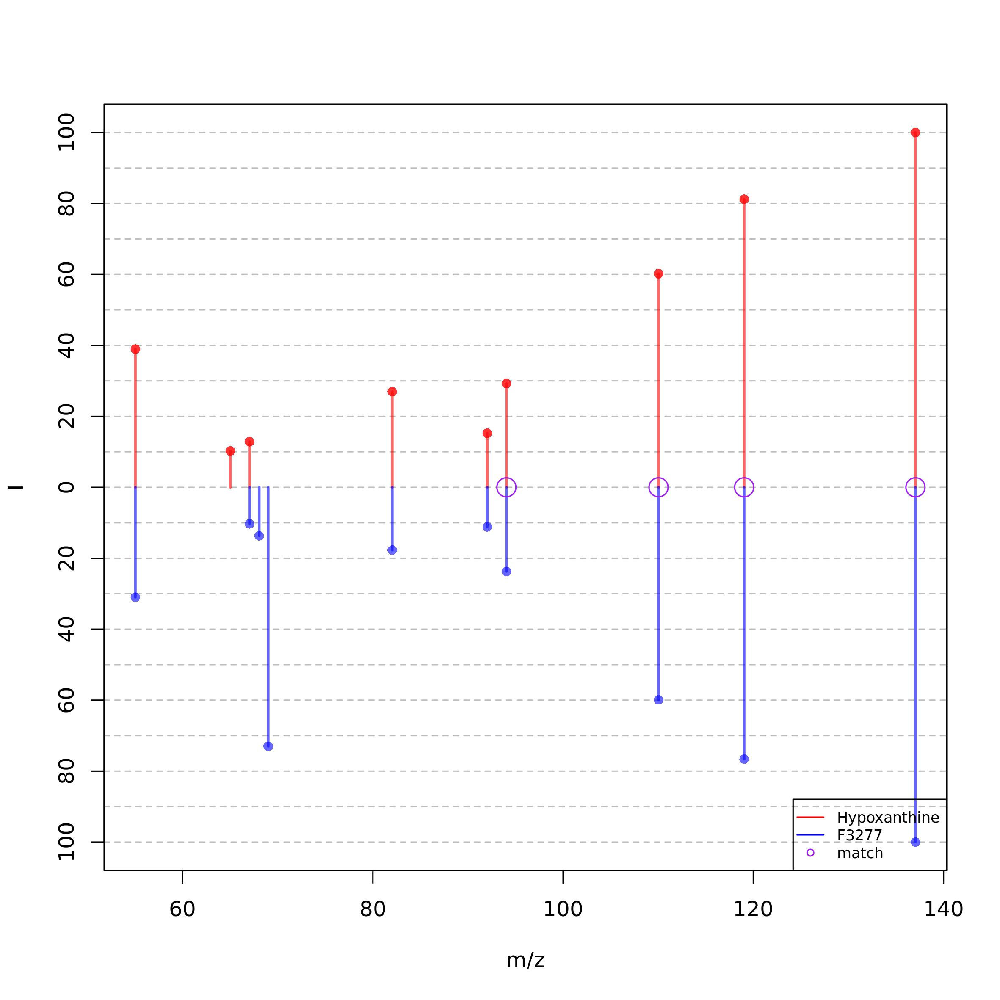{width=90%}

The function `h_map_MSMS_comparison()` draws heatmaps to visually compare ppm errors and RI differences between feature and metabolite spectra:

```{r, eval=FALSE}
h_map_MSMS_comparison(mL_norm_bio, metab_id = "L1660", feature_id = "F10165")
```

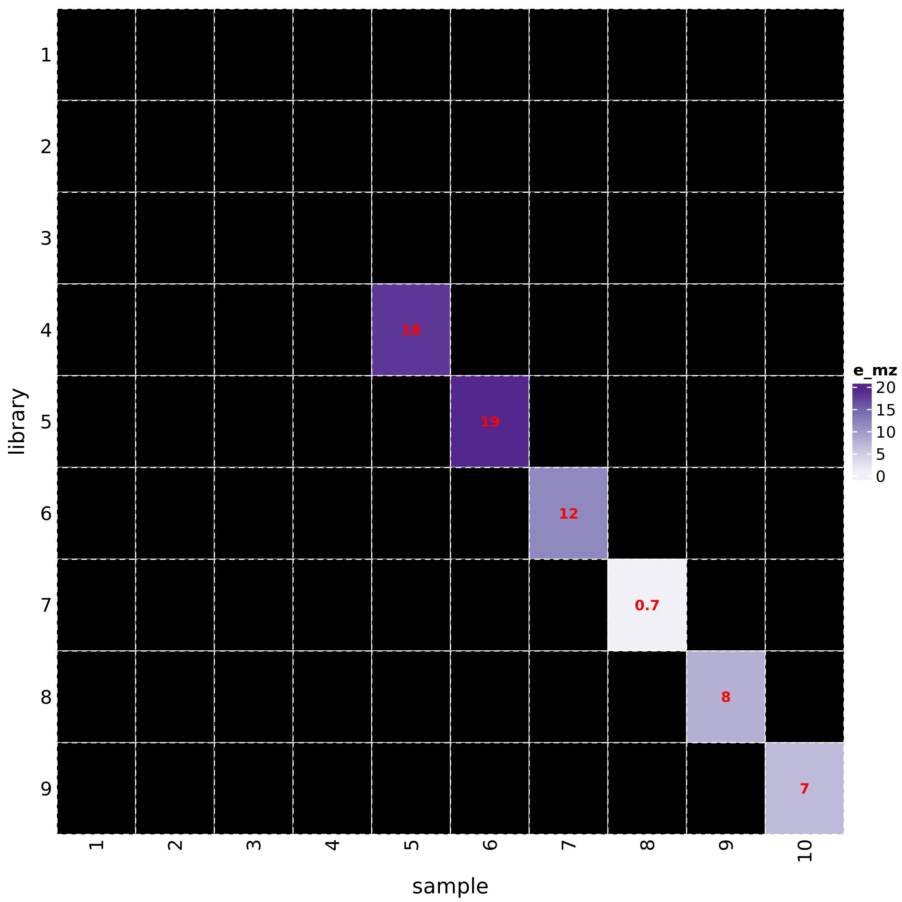{width=49%} 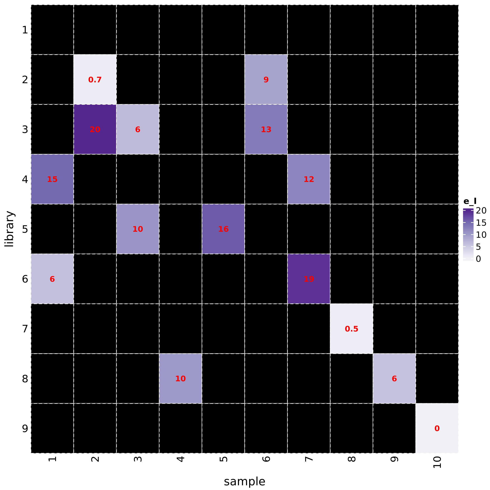{width=49%}

# Metabolite abundance visualization

The function `metab_boxplot()` draws boxplots of feature abundances grouped by the levels of a given factor:

```{r, eval=FALSE}
metab_boxplot(mRList = mL_norm_bio, col_by="class", group="class", features = "F3957")
```

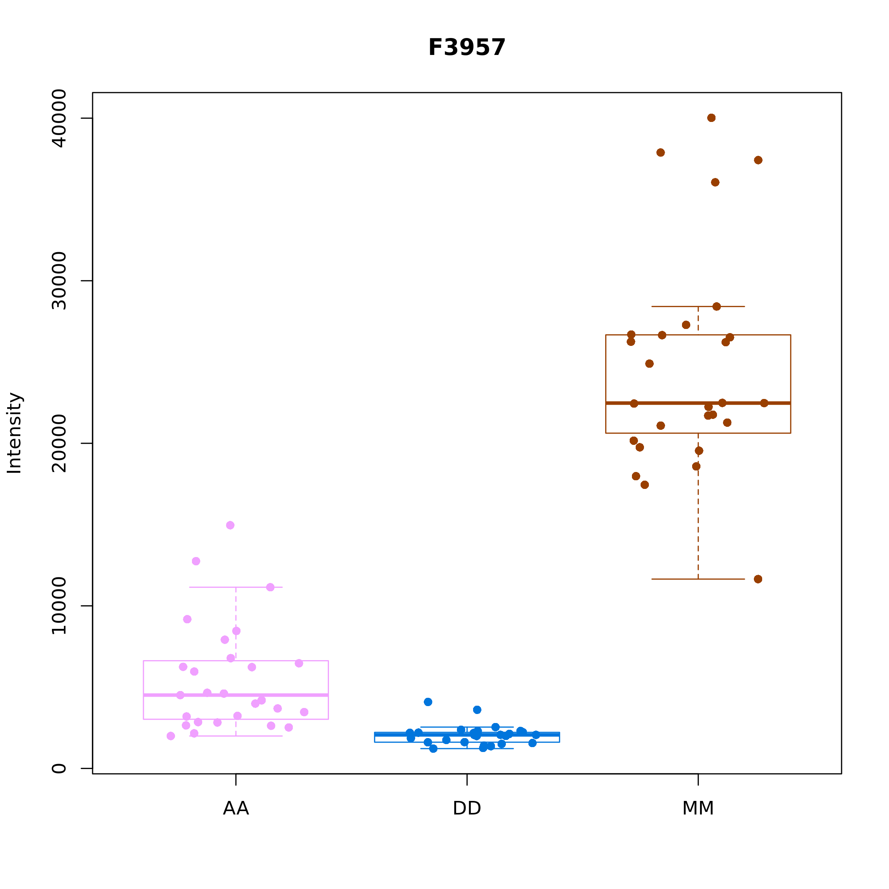{width=70%} 

The function `h_map()` provides heatmaps based on package ComplexHeatmap [@Gu2016]. Here we show the abundance of the most significant metabolites according to ANOVA test:

```{r, eval=FALSE}
significant_features <- select_sign_features(mL_norm_bio, test_method="anova", test_value = "q", cutoff_value = 10e-10, feature_id = "Name")

h_map(mL_norm_bio, scale_features=TRUE, column_ann="class", data.use = "data_ann", col_ann= pals::trubetskoy(3), features = significant_features, top = Inf, use_top_annoteted_metab = TRUE, test_method="anova", test_value = "q", show_column_names=FALSE)
```

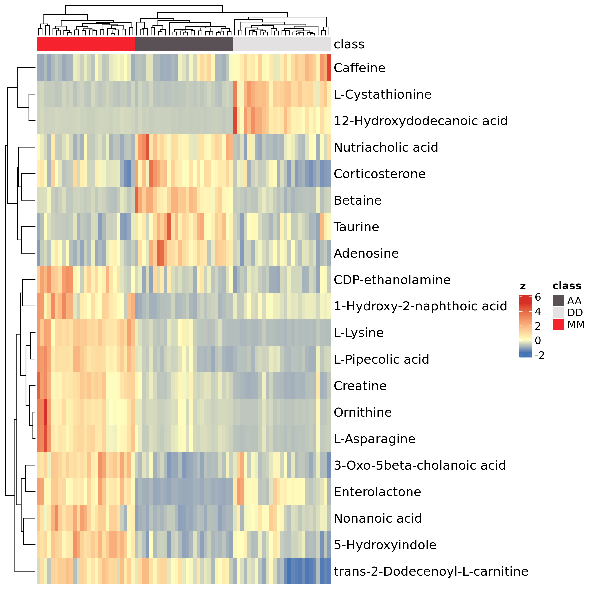{width=99%}

# Exporting metabolite annotation and stastical analysis results

The function `merge_stats_w_features()` joins the results of metabolite annotation and statistical analysis:

```{r, eval=FALSE}
metab_stats <- merge_stats_w_features(mRList = mL_norm_bio, test_method = "anova", test_value = "q", cutoff_value = 0.05)
```

It produces a list of data frames and an xlsx file creating with the following itmes/sheets:

- `metab_stat`: full table with feature annotation and statistical analysis results;

- `metab_stat_feat`: same as `metab_stat`, with the addition of feature intensities;

- `metab_stat_feat_known`: same as `metab_stat_feat`, but restricted to features with an assigned compound;

- `metab_stat_feat_sig`: same as `metab_stat_feat`, but only for statistically significant features;

- `metab_stat_feat_known_sig`: same as `metab_stat_feat`, but only for statistically significant features with an assigned compound.


# Pathway analysis

margheRita implements both Over Representation Analysis (ORA) and Metabolite Set Enrichment Analysis (MSEA), based on clusterProfiler [@Wu2021] over BioCyc, KEGG and Reactome pathway databases. These analyses can be run by means of function `pathway_analysis()`. In case of ORA the minimum requirements are the vector of PubChemCID to be tested and the reference universe of all PubChemCIDs in the dataset. In the following example we extract the PubChemCID of the most significat features according to anova and consider all the PubChemCID found in the dataset as reference universe:

```{r, eval=FALSE}
significant_CIDs <- unique(metab_stat_w_features_known_only_sign$PubChemCID)
significant_CIDs <- sub(";.*", "", significant_CIDs)

all_PubChemCID <-  unique(metab_stat_w_features$PubChemCID)[which(!is.na(unique(metab_stat_w_features$PubChemCID)))]
all_PubChemCID <- sub(";.*", "", all_PubChemCID)

pa_res <- pathway_analysis(in_list = significant_CIDs, universe = all_PubChemCID, type = "ora")
```
In case of MSEA, a named ranked vector of scores for all PubChemCIDs in the dataset, in decreasing order of importance:

```{r, eval=FALSE}
ranked_vector <- select_sign_features(mRList = mL_norm_bio, test_method="anova", test_value = "q", cutoff_value = Inf, feature_id = "Feature_ID", values = TRUE)
names(ranked_vector) <- vapply(names(ranked_vector), function(x) metab_stat_w_features$PubChemCID[which(metab_stat_w_features$Feature_ID==x)][1], character(1))
names(ranked_vector) <- sub(";.*", "", names(ranked_vector))

ranked_vector <- sort(-log10(ranked_vector), decreasing = T)
msea_res <- pathway_analysis(in_list = ranked_vector, type = "msea")
```

The result is a list that contains:

- a table with pathway descriptions;
- an object of class "enrichResult", which can be used to obtain various visualizations through clusterProfiler functions.

Here's an example of resulting tables for ORA:

```{r echo=FALSE}
mL_demo$ora
```
and MSEA:
```{r echo=FALSE}
mL_demo$msea
```

A plot for the pathways analysis generated with ORA can be generated using the following function:

```{r, eval=FALSE}
barplot_ora(pa_res, p = "p.adjust", filename = "pathway_analysis_ora")
```

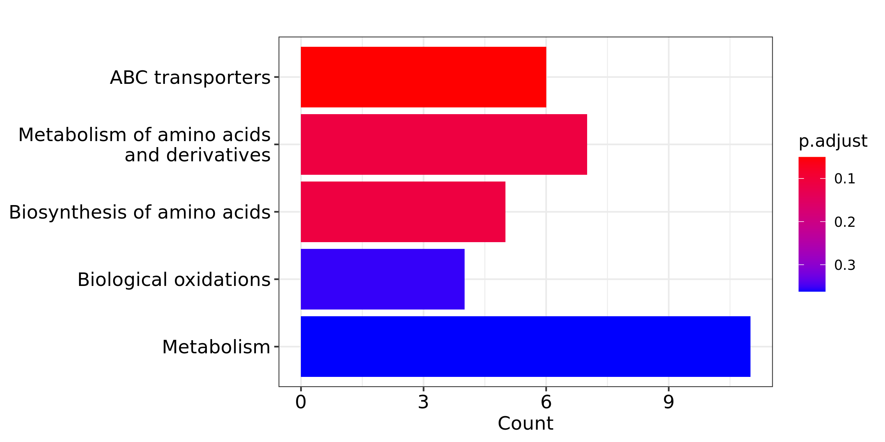{width=80%}

See the [documentation](https://bioconductor.org/packages/release/bioc/vignettes/clusterProfiler/inst/doc/clusterProfiler.html) of clusterProfiler for further information.

# References
