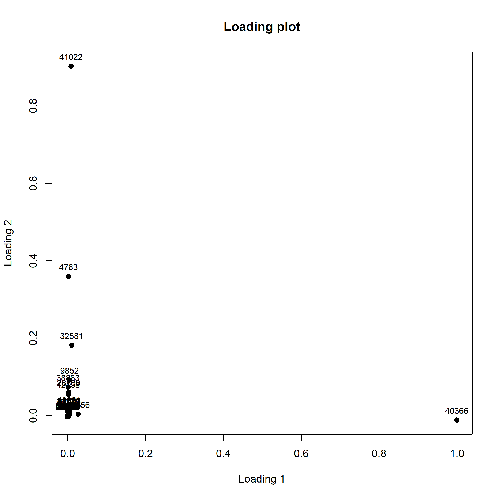

```{r setup, include = FALSE}
knitr::opts_chunk$set(
  collapse = TRUE,
  comment = "#>"
)
```

# Getting started

{width=60%}

The package can be installed using devtools:
```{r, eval=FALSE}
if (!requireNamespace("devtools", quietly = TRUE)) {
  install.packages("devtools")
}
devtools::install_github("emosca-cnr/margheRita", dependencies = T)
```

# Reading input files

The function `read_input_file()` imports dataset and its relative metadata to be analyzed, as .txt,.csv or .xlsx format, creating margheRita object called "mRList". mRList is a S4 (giusto?) object contains S3 objects with information of experimental data [data], of metabolites annotation [metab_ann] QC experimental data  [QC], metadata [sample_ann]. 
Samples and QCs can be imported as unique matrix for data  or can be splitted into two: one for samples and one for QCs.
The number of the column that contain information about retention time, rt, m/z and starting data column have to be specified.


Currently margheRita includes two datasets (decidere il dataset di esempio). To load the first one, "example1", run:

```{r, eval=FALSE}
input_data_file <- system.file("extdata", "example1.xlsx", package = "margheRita")
input_metadata_file <- system.file("extdata", "example1_meta.xlsx", package = "margheRita")
mRList <- read_input_file(input = input_data_file, metadata = input_metadata_file, split_QC = TRUE, rt_col = 2, mz_col =3 , data_start_col = 4)
```
To load the second, a dataset where metabolite intensities show a drift related to injection order, run:
```{r, eval=FALSE}
input_data_file <- system.file("extdata", "dataset_drift.xlsx", package = "margheRita")
input_metadata_file <- system.file("extdata", "dataset_drift_metadata.xlsx", package = "margheRita")
mRList <- read_input_file(input_data_file, metadata = input_metadata_file, data_start_col = 8, rt_col = 2, mz_col = 3)
```
 

The mRList object has this structure:

Objects in mRList  | Description
------------- | -------------
data  | matrix containing metabolite intesity
metab_ann  | metabolite annotation
sample_ann | sample annotation
QC | matrix containing metabolite intesity for QC
QC_ann | QC annotation

Importantly, the mRList can be translated into `metaboset` or `MSnSet` classes:
```{r, eval=FALSE}
mset <- as.metaboset.mRList(mRlist)
msnset <- as.MSnSet.mRList(mRlist)
```

# Preprocessing: m/z filtering, missing values imputation

The step of preprocessing data is crucial in order to filter values that are not accurated and missing values using m_z_filtering function.
If missing values are > 80% of the measured values, feature is trashed, otherwise missing values have to be imputed.
Missing values have to be imputed using imputation functions.

# m/z filtering
m/z function filters features with m/z value not measured in accurate manner. Values with the first decimal place comprises between 4 and 8 are excluded.

```{r, eval=FALSE}
mRList_filt <- m_z_filtering(m_list = mRlist, lower_quality_mass_acc = 0.4, upper_quality_mass_acc = 0.8, do_plot = T, color="black")
mRList_filt <- filter_NA(mRList_filt)

```

## Imputation missing value

Imputation function provides to impute missing value of each feature replacing NA with a random number, calculated as the 10% and 25% of the minimum value of the feature. 

```{r, eval=FALSE}
mRList_imp<-imputation(mRList, seed=NULL, a=0.1, b=0.25)

```

## Heatscatter Cromatography

This function provide an overview of all the $m/z$ features in all experiments during all the chromatogram, by generating a Heatscatter plot using `LSD::heatscatter()` function exploiting *LSD* package (https://cran.r-project.org/web/packages/LSD/index.html)
```{r, eval=FALSE}
heatscatter_chromatography(mRList, mz_limits = NULL, rt_limits = NULL, sample = NULL)
```
* `sample`: character parameter, default value is `NULL`, if specified in the plot will be provided only $m/z$ feature present in that specific sample.

* `mz_limits`: vector parameter, default value is `NULL`, that specifies the minimum and maximum value of the $m/z$ features window that have to be displayed.

* `rt_limits`: vector parameter, default value is `NULL`, that specifies the minimum and maximum value of the retention time window that have to be displayed.

{width=100%}

## Batch effect correction

batch_effect function remove batch effect using *limma* package. Batch of each samples is indicated in a column, as number, in metadata and then reported in sample_ann data frame.

```{r, eval=FALSE}
mRList<-batch_effect(mRList)

```

## Normalization

The choose of normalization is a key passage in the analysis of metabolomic data.margheRita provides three ways for normalizing metabolite profiles: 'log', log2-normalization (scrivere qualche parola), 'reference', reference values can be imported and used for normalization, 'pqn' (probabilistic quotient normalization),for every feature the mean response is calculated across all QC samples. A reference vector is then generated. The median between the reference vector and every sample is computed obtaining a vector of coefficients related to each sample. Each sample is then divided by the median value of the vector of coefficients; this median value is different for each sample. This method was adapted by Dieterle et al. (2006) (see references). Its purpose is to take into account the concentration changes of some metabolite features that affect limited regions of the data.

Here's the code for using pqn normalization:

```{r, eval=FALSE}
mRList <- calc_reference(mRList)
mRList_norm <- normalize_profiles(mRList, method = "pqn")
```


## Principal Component Analysis and plot score and loading plot

pca_fast function allows to perform Principal Component Analysis (PCA) during the analysis. Data can be scaled specified the type of scaling to use, the user can choose between "pareto", "uv","vector" or "none". QC can be included or not in the analysis.
Graphical outputs are pairs plot and screeplot, number of the principal components (PCs) to visualize has to be chosen by user. Tables of loadings and scores can be saved as .csv files. 
QC can be included in the analysis. After function collapse_tech_rep QCs have to be excluded from PCA. (lo scriviamo????)

```{r , eval=F}
mRList<-pca_fast(mRList, dirout="PCA", col_by="class", method="svd", scaling=c("pareto"), center=TRUE, include_QC=TRUE, top=Inf, nPcs=5, write_output=FALSE)
```

{width=60%}


Plot2DPCA_fast has to be used after pca_fast function, it allows to plot score and loading 2D plots choosing the best couple of PCs.


```{r, eval=FALSE}
Plot2DPCA_fast(mRList, pcx=1, pcy=2, dirout = "PCA", col_by="class", include_QC=TRUE)
```


{width=60%}


{width=60%}


## Filter by coefficient of variation

CV function calculates the coefficient of variation for each metabolite for samples and QC, separately, to assess the precision and repeatability of the measurements. 
CV is calculated using the following equation:
     $CV= (stdev/mean)*100$.
If $CV QC > CV sample$ metabolite is trashed away. The outputs are data frame with only reliable features. 

```{r, eval=FALSE}
mRList<-CV(mRList)

```


## Collapse technical replicates

The collapse_tech_rep function calculated the mean of each feature for technical replicates, in order data only of biological replicates. In this manner data and metadata contain information only of biological replicates.


```{r,eval=FALSE}
mRList<-collapse_tech_rep(mRList, remove.QC=TRUE)
```

# Univariate analysis

margheRita allows to do also statistical analysis calculating mean, median and standard deviation, fold change and univariate analysis (choosing between Student t test, U-test, kruskal-wallis and anova).

## Descriptive statistics: mean, median and standard deviation

mean_median_stdev_samples function allows to retrieve principal descriptive statistics indexes for all $m/z$ features. The function retrieves for all features across all different groups the mean, median and standard deviation. Results were reported in added columns in metab_ann.
In addition, tables can be saved as .csv files turning into true write_output, parameters.


```{r, eval=FALSE}
mRList <- mean_median_stdev_samples(mRList, write_output = F)
```

## Differential intensity analysis

Differential intensity analysis works on collapsed data, data frame has to contain only biological replicates,
hence before calculating fold change (FC) collapse_tech_rep function has to be launch.
Results were reported in metab_ann.
margheRita implements differential abundance analysis by using the fold change index: $log_2(\frac{\bar{B}}{\bar{A}})$ where $\bar{B}$ and $\bar{A}$ are the second and the first term of the specified ratio,respectively. 

Within margheRita regarding this context are implemented two functions: calculate_lfc_all, that calculates log2 FC among all useful pairwise comparisons, calculate_lfc, that calculates log2 FC indicating the couple of samples to compare.

The function calculate_lfc_all calculates log2 fold change for all $m/z$ features, among all useful pairwise comparisons. The threshold, for the upper and lower values, has to be specified in lfc_threshold, by default threshold is set at 0.25. (è giusto? nella funzione non trovo sto parametro)

```{r, eval=FALSE}
mRList <- calculate_lfc_all(mRList = mRList, lfc_threshold = 0.25)
```

If the user is interested into a specific contrast, comparing two specific groups and not all if you have more than two groups under study, calculate_lfc functions has to be used. Indeed in addition to lfc_threshold, in this function, also the names of the two groups to compare has to be specified as vector, as parameter of contrast_samples. 

```{r, eval=F}
mRList <- calculate_lfc(mRList = mRList, lfc_theshold = 0.25, contrast_samples = c("BAL_STAND", "NOD_STAND"))

```


## Check normal distribution of metabolites

norm_check function uses Shapiro-wilk's test to check the normal distribution of each metabolite. The output is a list of p-values for each feature: metabolite with a p-value<0.05 is not normally distributed, metabolite with a p-value>0.05 is normally distributed.

```{r, eval=FALSE}
mRList$shapirotest<-norm_check(mRList)

```

## Statistical tests (Student t test, Wilcoxon, Kruskal, Anova)

Univariate function allows to perform univariate analysis comparing only biological replicates, hence before starting univariate analysis collapse_tech_rep function has to be launched.
User can choose different types of statistical tests to apply: Student t-test, Wilcoxon test, anova or kruskal.

```{r, eval=FALSE}
mRList$univariate<-univariate (mRList, test_method=c( "anova"), paired=c("FALSE"), group_factor="class")
```
# Graphic data visualization

In addition to the plots from PCA analysis, margheRita provides also boxplots and heatmaps to graph results. 

## Boxplot Check function

metab_boxplot function draws boxplots of the features. Boxplots are drawn for all the features, it takes time according to the number of features, or for only features of interest, indicated in the parameter features as vector.


```{r, eval=FALSE}
metab_boxplot(mRList, dirout="Boxplot", col_by="class", group="class")
```


## Heatmap

h_map function draws heatmap taking all metabolites or only features of interest.

```{r}
h_map(mRList, dirout="heatmap", col_ann=NULL, col=NULL, scale_features=TRUE, features=NULL, samples=NULL, top=500)
```


# Metabolite identification

Metabolite identification is based on a level-1 library containing about 800 metabolites spanning several biological functions. The identification follows these steps:

* precursor RT;

* precursor ppm error;

* ppm errors of ions;

* relative intensity of ions.


## Generate dataset for metabolite annotation 

Mass spectrometry provides us variety of information but, metabolite annotation needs only four set of data called feature data and reference including retention time (RT) and m/z and spectra of the feature and reference. 
`annotation_dataset()` function generate required data. 


## Metabolite annotation function 

metabolites_annotation function uses the four dataset and default values for retention time (RT) threshold, range of acceptable and unacceptable PPM error, acceptable relative intensity in order to have a clean dataset and number of the most intensive peaks which are calculated for acceptable PPM error. All these values are modifiable based on the specificity and goal of the study. 

```{r, eval=FALSE}
metabolites_annotation = metabolite_annotation(feature_data = NULL , reference = NULL , feature_spectra = NULL, reference_spectra= NULL,
                                               rt_err_thr=1, 
                                               unaccept_flag=15, accept_flag=5, suffer_flag=10,
                                               acceptable_RI = 10,
                                               n_peaks=1, acceptable_PPM_err = 10)
```

* `feature_data`: ... parameter, default value is NULL. it is a data frame contains retention time (rt) and m/z (mz) of the sample which are stored by their specific ID (Feature_ID)

* `reference`: ... parameter, default value is NULL. it is a data frame contains retention time (rt) and m/z (mz) of the compounds which are stored by the name of the compound (Name)

* `feature_spectra`: ... parameter, default value is NULL. it is extracted from MS/MS spectroscopy. it is a list of sample ID which each contains list of its m/z and Intensity for each ion

* `reference_spectra`: ... parameter, default value is NULL. it is extracted from MS/MS spectroscopy. it is a list of compounds names which each contains list of its m/z and Intensity for each ion.

* `rt_err_thr`: ...parameter, default value is 1. it is tolerance window of retention time that align sample with compound. 

* `unaccept_flag`: ...parameter, default value is 15. it is specify the unacceptable number for PPM error. the number above this will be deleted.

* `accept_flag`: ...parameter, default value is 5. it is specify a range of the acceptable number for PPM error. PPM error below 5 will tagged by "super" flag and PPM error above 5 and below 10, tagged by "acceptable" flag.

* `suffer_flag`: ...parameter, default value is 10. it is specify a lowest acceptable number for PPM error in suffer group. range of PPM error between 10 and 15 will tagged as "suffer".

* `acceptable_RI`: ...parameter, default value is 10. it is cleaning the data set both in library and sample by deleting the low intensity peaks.

* `n_peaks`: ...parameter, default value is 1. it is specify the number of the most intense peaks of ion in MS/MS data that PPM error are calculated on.

* `acceptable_PPM_err`: ...parameter, default value is 10. it is specify the lowest acceptable PPM error for the ions in MS/MS data.


## The workflow of metabolic identification 

metabolites_annotation function consists in four main steps:

a) Retention time (RT) similarity: comparison of RT of precursor in the library and in the samples.
b) Mass similarity: comparison of mass of precursor in library and sample, calculating PPM error
c) Conversion intensity to relative intensity
d) Ion mass similarity by calculating PPM error for intensive peaks for MS/MS spectroscopy 

### a)Retention time similarity

If the RT for the metabolite i in reference library is t_i and the RT for the compound j in the sample be t_j then the retention time error between a sample feature j and metabolite i in the reference library is the absolute difference between the two retention times

```{r, eval=FALSE}
RT = check_RT(feature_data = NULL , reference = NULL, rt_err_thr= rt_err_thr)
```

### b)Mass similarity by calculating PPM error

The similarity between two masses is calculated by the ppm error (parts per million) which is determining mass tolerance. The PPM error is calculated as the relative error between the mass of a feature j and mass of the reference in the library i.

According to our study goal, we delete those with bad PPM error and assign a feature to the one with good PPM error in mass status column. 

Ppm error < a – super

Ppm error < b – acceptable, may happen when ions are of low intensities

Ppm error < c – may happen when machine suffer a bit.

Ppm error > c – not good


```{r, eval=FALSE}
mass = check_mass(feature_data = NULL , reference = NULL, unaccept_flag= c, accept_flag= a, suffer_flag= b)
```


#### Merging ideal candidate in term of Retention Time and PPM error

```{r, eval=FALSE}
RT_mass = check_RT_mass (RT , mass, reference= NULL )
```

### c) Convert intensity to relative intensity: establishing new library & sample data by calculating relative intensity

Convert intensity to relative intensity and deleting the negligible relative intensity, both in library and sample spectra.
Relative intensity is calculated by dividing ion intensity to the maximum ion intensity in spectra.

```{r, eval=FALSE}
RI_lib = RI_lib_data ( reference = NULL , RT_mass, acceptable_RI = acceptable_RI)
```


```{r, eval=FALSE}
RI_sample = RI_sample_data (feature_spectra= NULL, acceptable_RI = acceptable_RI )
```


 


# Pathway analysis

margheRita implements both Over Representation Analysis (ORA) and Metabolite Set Enrichmenet Analysis (MSEA) relying on clusterProfiler and NCBI Biosystems.

## ORA

A toy example of ORA considering as input metabolite list, the metabolites belonging to the Glycolysis pathways (id=82926) and other 10 randomly selected metabolites:
```{r, eval=FALSE}
  #ORA Example
  metab_list <- unique(c(bsid2cid$CID[bsid2cid$bs_id=="82926"], sample(unique(bsid2cid$CID), 10))) #glycolysis
  res_ora <- pathway_analysis(in_list = metab_list, universe = metabolite_annotation$PubChem.CID, minGSSize = 5)
```

{width=100%}


